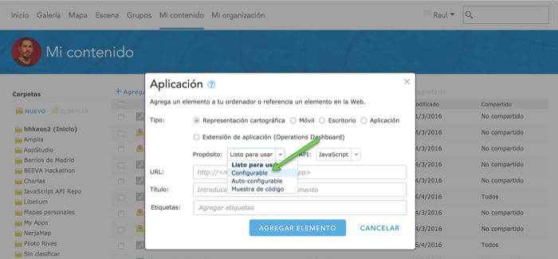

<!-- .slide: class="title" -->

## Apps configurables personalizadas
Plataforma ArcGIS para desarrolladores web

[desarrolladores.esri.es/moocs](http://desarrolladores.esri.es/moocs)

---

<!-- .slide: class="section" -->

##  Aplicaciones *configurables*
<small>```Purpose: configurable```</small>

* **Pros**: Los parámetros de configuración se editan desde el editor <br>
de ArcGIS Online o Portal que se encuentra en:<br>
<small>https://<span style="color:gray">&lt;root-url&gt;</span>/home/webmap/configureApp.html?appid=<span style="color:gray">&lt;item-instance-id&gt;</span>?f=json</small>

* **Cons**: Los parámetros de configuración son estáticos e iguales <br>
	para todas las aplicaciones (se especifican en [formato JSON](http://doc.arcgis.com/es/arcgis-online/create-maps/configurable-templates.htm)). <br>Parámetros habituales:
	título, logotipo, posibilidad de activar /<br>desactivar widgets, ...

* **Algunos ejemplos**:
	* [Basic](http://www.arcgis.com/home/item.html?id=b17113eb9535427db477777f86f25d63) & [Classic](http://www.arcgis.com/home/item.html?id=f232cac140a8495f9990cc9d2bb66dd9) & [Simple Map](http://www.arcgis.com/home/item.html?id=9ae78842d98a4178bd4a794449324349) Viewers
	* [Local Perspective](http://www.arcgis.com/home/item.html?id=6e02b538bea841ed858ef9f52709b655), Crowdsource [Reporter](http://www.arcgis.com/home/item.html?id=74b016cef7db42b28599adc5a14b010c)
	& [Polling](http://www.arcgis.com/home/item.html?id=bb3fcf7c3d804271bfd7ac6f48290fcf), etc.

---

<!-- .slide: class="section" -->
##  Crear plantilla *configurables*

[](http://www.arcgis.com/home/item.html?id=b17113eb9535427db477777f86f25d63)

* Espeficicación JSON: typeKeywords = ["**Configurable**"])

* La configuración de cada aplicación instanciada se <br>
almacena en los datos del item


---

<!-- .slide: class="section" -->
## Configuración y visualización
<small>Apps configurables</small>

*
 para usa para visualizar datos prose intancia a partir de un item de la organización que se recibe como párametro por URL.

---

<!-- .slide: class="section" -->

## Metadatos: App configurable vs App configurable RTU
Tanto plantllas como instancias son ```"type": "Web Mapping Application"```
* Plantillas (Metadatos: typeKeywords: "configurable"):
	* Configurable:
		* Data: objeto JSON definiendo los parámetros de configuración
	* selfConfigured:
		* Data: vacío
* Instancia (Metadatos: typeKeywords: "Ready To Use")
	* Configurable & selfConfigured:
		* Data: configuración establecida

---

<!-- .slide: class="section" -->

## Datos de las instancias
Configurable:
* Item: tipo Web Mapping Application
* Data: en el atributo **source** se indica el **item id** de la plantilla
de donde se recuperarán datos de configuración.

Al ser de tipo **Web Mapping Application** es obligatorio que en las keywords
tenga la tecnología (JavaScript) y el tipo de plantilla (purpose), que en nuestro
caso será Configurable

---

<!-- .slide: class="section" -->

## Recursos y herramientas
Podemos crearlas :
* https://github.com/Esri/application-boilerplate-js
* Web AppBuilder para usuarios no desarrolladores

---

<!-- .slide: class="section" -->

## ¿Qué tecnología debo usar?
La que mejor se adapte a los requisitos de tu app:
* Webmap: API JS + [angular-esri-map]

Si necesitas:
* Análisis: API JS
* Renderizadores avanzados:
* Móvil: leaflet, calcite,
* Basada en formularios: esri-angular
