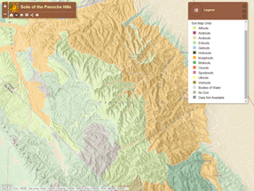

<!-- .slide: class="title" -->

## Funcionamiento interno <br>de las apps configurables
Plataforma ArcGIS para desarrolladores web

[desarrolladores.esri.es/moocs](http://desarrolladores.esri.es/moocs)

---

<!-- .slide: class="section" -->
## ¿Qué es una app configurable internamente?

> Una app configurable es un item registrado en una organización con tipo:
"**Web Mapping Application + Configurable** + \[**SelfConfigured**\]", que
contiene información como por ejemplo la URL a la plantilla de código que
se usará como base para las futuras aplicaciones listas para usar.

---

<!-- .slide: class="section" -->
## Contenido de un item

* Podemos acceder a los contenidos de cualquier <br>
  item de nuestra organización a través de varios <br>
  endpoints de la API REST, por ejemplo:

  * Metadatos:<br>
  [<small>https://<span style="color:gray">&lt;root-url&gt;</span>/sharing/rest/content/items/<span style="color:gray">&lt;item-id&gt;</span>?f=json</small>](https://www.arcgis.com/sharing/rest/content/items/b17113eb9535427db477777f86f25d63?f=json)

  * Datos:<br>
  [<small>https://<span style="color:gray">&lt;root-url&gt;</span>/sharing/rest/content/items/<span style="color:gray">&lt;item-id&gt;</span>/**data**?f=json</small>](https://www.arcgis.com/sharing/rest/content/items/b17113eb9535427db477777f86f25d63/data?f=json)

---

<!-- .slide: class="section" -->
## Diagrama simplificado


---

<!-- .slide: class="section" -->
## Demo: obtener un item

[](http://www.arcgis.com/home/item.html?id=b17113eb9535427db477777f86f25d63)

Cómo usar POSTMAN para obtener el item<br>
 de la App configurable "[Basic Viewer](http://www.arcgis.com/home/item.html?id=b17113eb9535427db477777f86f25d63)"

---

<!-- .slide: class="section" -->

## Metadatos
<small>Ejemplo de aplicación configurable / auto-configurable</small>

```
{
	"id":           "<item-id, e.x: b17113eb9535427db477777f86f25d63>",
	"type":         "Web Mapping Application",
	"typeKeywords": ["<Configurable / selfConfigured>", "JavaScript", ...],
	"tags":         ["ArcGIS web application template"],
	"url":          "<template-code, e.x: /apps/Viewer/index.html>",
	...
}
```

---

<!-- .slide: class="section" -->

## Datos de un item
<small>Ejemplo de aplicación configurable</small>

```javascript
{
	"configurationSettings": [{
		"category": "Settings",
		"fields": [{
			"type": "string",
			"fieldName": "title",
			"label": "Title",
		}, ...]
	}]
}
```

> **Nota**: las aplicaciones auto-configurables no almacenan nada en el campo
de datos

---

<!-- .slide: class="section" -->
## Mi contenido: Items de un usuario

ID|Type|Metadata|Data
---|---|---|---
[xx..xx]()|Webmap|Autor, etc|Configuración del mapa
[b7..c5](http://www.arcgis.com/home/item.html?id=b7084a6fc08149428c193567d1f205c5)|Document Link|URL|
[b1..63](http://www.arcgis.com/home/item.html?id=b17113eb9535427db477777f86f25d63)|App configurable|Code URL|Params. configurables
[da..da](http://www.arcgis.com/home/item.html?id=da029c7670514be1b5a10b60825cd8da)|App auto-configurable|Code URL|
[96..64](http://www.arcgis.com/home/item.html?id=96e7f5c46d124acb87643a80707be064)|App. configurable RTU|URL|ID plantilla + Params
[dd..c6](http://www.arcgis.com/home/item.html?id=ddf48b0d9d2543f9bea156af2050d6c6)|App. auto-configurable RTU|URL|Parámetros

> RTU: Ready To Use

---

<!-- .slide: class="section" -->

## Cómo crear un item 1/3
<small>Tipo: App Configurable</small>

Características:
Nota: el tipo de este item es "**Web Mapping Aplication**" y contener "**Ready To Use**" entre las palabras
clave del tipo

> Demo: POSTMAN

---

<!-- .slide: class="section" -->

## Cómo crear un item 2/3
<small>Tipo: App Auto-Configurable</small>

Características:
Nota: el tipo de este item es "**Web Mapping Aplication**" y contener "**Ready To Use**" entre las palabras
clave del tipo

> Demo: POSTMAN


---

<!-- .slide: class="section" -->

## Cómo crear un item 3/3
<small>Tipo: App Configurable RTU</small>
> Nota: el tipo de este item es "**Web Mapping Aplication**" y contener "**Ready To Use**" entre las palabras clave del tipo

> Demo: POSTMAN

---

<!-- .slide: class="section" -->

## Compartir una nueva app configurable

* Para que una persona de nuestra organización pueda <br>
crear Apps RTU usando una app configurable personalizada:

  1. Ambos debemos pertenecer a un mismo grupo (cualquiera)

  2. Nosotros debemos compartir el item de la app configurable<br>
     o auto-configurable con dicho grupo

  3. El usuario (admin?) que quiera usarla debe de configurar<br>
     los ajustes para usar las plantillas compartidas con <br>
     dicho grupo

---

<!-- .slide: class="section" -->

## Apps configurables creadas por Esri vs personalizadas

Las dos únicas diferencias son:
* Dónde se alojan
* Visibilidad por defecto
