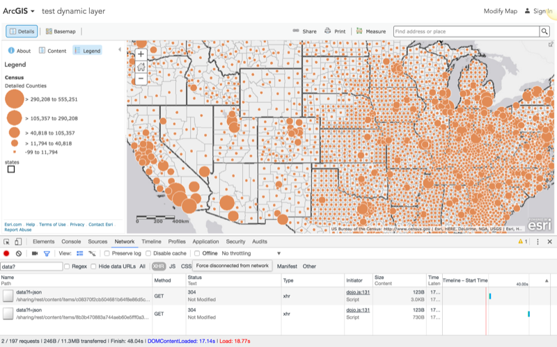

<!-- .slide: class="title" -->

## Consejos y trucos
Plataforma ArcGIS para desarrolladores web

[desarrolladores.esri.es/moocs](http://desarrolladores.esri.es/moocs)

---

<!-- .slide: class="section" -->

### Encontrar el fichero JSON

<small>Usa el inspector de tu navegador y filtra en las peticiones XHR por: `data?`</small>

---

<!-- .slide: class="section" -->

### ArcGIS Online Assistant

* Si alguna vez se te queda corto el editor de 
  web maps puedes usar [ago-assitant](https://github.com/Esri/ago-assistant) para:

  * Copiar items entre cuentas

  * Ver y editar el JSON de cualquier item

  * Cambiar las urls de servicios de desarrollo  a producción en un web map

  * Cambiar URL de *apps auto-configurables*  o servicios de entidades

  * Ver tus contenidos más populares

---

<!-- .slide: class="section" -->

### Usar el webmap como apoyo

* Puedes extraer información muy útil  
  de la especificación del web map

  * [renderers](https://www.arcgis.com/sharing/rest/content/items/596c4a99ac4b4913badfe5bff541a87f/data?f=json)

  * [popupinfo](https://www.arcgis.com/sharing/rest/content/items/596c4a99ac4b4913badfe5bff541a87f/data?f=json)

  * etc

---

<!-- .slide: class="section" -->

### Integrar con un backoffice personalizado

> Si backoffice va más allá de lo que te ofrece el  
editor de ArcGIS Online **puedes reutilizar y extender** 
el web map como modelo de datos geográficos.

<small>Más adelante veremos cómo las apps configurables también pueden ayudarnos en este caso</small>

---

<!-- .slide: class="section" -->

## Extendiendo con BD propia

<iframe src="https://esri-es.github.io/webmap-extension-panel-sample/" style="width:100%;height:550px"></iframe>

Ver código fuente: [iframe](https://github.com/esri-es/moocs/blob/gh-pages/plataforma-arcgis/desarrolladores-web/web-maps/consejos-y-trucos/custom-panel/panel-extension.html#L53) | [otros parámetros](https://github.com/esri-es/moocs/blob/gh-pages/plataforma-arcgis/desarrolladores-web/web-maps/consejos-y-trucos/custom-panel/panel-params.html) | [formulario](https://github.com/esri-es/moocs/blob/gh-pages/plataforma-arcgis/desarrolladores-web/web-maps/consejos-y-trucos/custom-panel/panel-extension-form.html#L23)

---

<!-- .slide: class="section" -->

## Previsualización de un feature layer

Smartmapping, simbología, ...

https://arcgis-devlabs.maps.arcgis.com/home/webmap/viewer.html?embedded=1&type=itemDetail&layers=883cedb8c9fe4524b64d47666ed234a7&layerId=0
---

<!-- .slide: class="questions centered" -->

## Preguntas

Para cualquier duda puedes usar los  [*issues* del proyecto](https://github.com/esri-es/moocs/issues) en Github

---

<!-- .slide: class="end" -->
