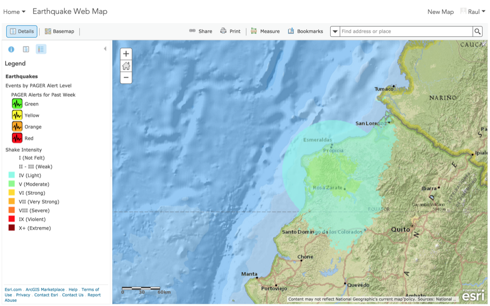

<!-- .slide: class="title" -->

## Especificación del web map
Plataforma ArcGIS para desarrolladores web

[desarrolladores.esri.es/moocs](http://desarrolladores.esri.es/moocs)

---

<!-- .slide: class="section" -->

## [Earthquake web map](www.arcgis.com/home/webmap/viewer.html?webmap=7d987ba67f4640f0869acb82ba064228)

[](www.arcgis.com/home/webmap/viewer.html?webmap=7d987ba67f4640f0869acb82ba064228)

---

<!-- .slide: class="section" -->

## Detalles

**Propiedades de alto nivel**

```javascript
{
  "authoringApp": "X",
  "authoringAppVersion": "Y",
  "version": "Z",
  "operationalLayers": [],
  "baseMap": {},
  "spatialReference": {},
  "bookmarks": [],
  "applicationProperties": {},
  "presentation": {},
  "table": {},
  "widget": {}
}
```

> Ver: [web map original](https://www.arcgis.com/sharing/rest/content/items/7d987ba67f4640f0869acb82ba064228/data?f=json) | [comentado](web-map-sample.json)

---

<!-- .slide: class="section" -->

## Referencias
* [Índice de propiedades](https://developers.arcgis.com/web-map-specification/objects/)
* [web-scene-sample.json](web-scene-sample.json)

---

<!-- .slide: class="questions centered" -->

## Preguntas

Para cualquier duda puedes usar los <br>[*issues* del proyecto](https://github.com/esri-es/moocs/issues) en Github

---


<!-- .slide: class="end" -->
