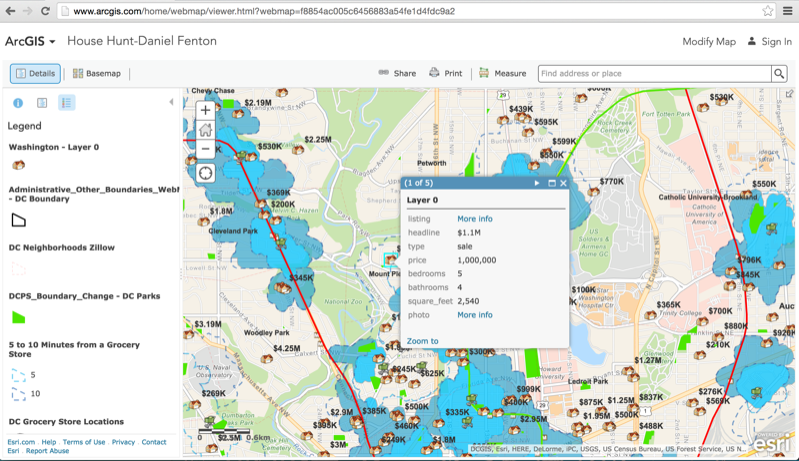

<!-- .slide: class="title" -->

## Introducción a los webmaps
Plataforma ArcGIS para desarrolladores web

[desarrolladores.esri.es/moocs](http://desarrolladores.esri.es/moocs)

---

<!-- .slide: class="section" -->
## Qué es un webmap
> Es el término usado en la plataforma ArcGIS para denominar la represetanción
  de un mapa en formato **JSON**

---

<!-- .slide: class="section" -->

## Información contenida
* **Metadatos**: título, descripción, autor, fecha de <br>
creación y modificación, etiquetas, valoraciones, etc.

* **Información de referencia**: mapa base, referencia <br>
espacial, extensión inicial, etc.

* **Capas operacionales**: URLs de los servicios, orden <br>
de las capas, simbología/renderizadores, configuración de<br>
popups, opacidad, etc.

* **Otros**: marcadores, notas de mapa, etc.

---

<!-- .slide: class="section" -->

## Ejemplo: [Metadatos de un webmap](http://www.arcgis.com/sharing/rest/content/items/1a40fa5cc1ab4569b79f45444d728067/data?f=json)
<small>https://<span style="color:gray">&lt;root-url&gt;</span>/sharing/rest/content/items/<span style="color:gray">&lt;webmap-id&gt;</span>?f=json</small>

```javascript
{
	"id": "1a40fa5cc1ab4569b79f45444d728067",
	"owner": "acarroll73",
	"orgId": "nzS0F0zdNLvs7nc8",
	"created": 1317674957000,
	"modified": 1346084228000,
	"guid": null,
	"name": "ecological_footprints_1316885358916",
	"title": "Ecological Footprints of Nations",
	"type": "Web Map",
	"typeKeywords": ["Web Map", "Explorer Web Map", "Map", "Online Map", "ArcGIS Online"],
	"description": "Código HTML de con la descripción",
	"tags": ["Global Footprint", "ecological footprint", "sustainability", "nations", "carbon footprint"],
	"snippet": "The ecological footprints of the world's nations as calculated by the Global Footprint Network",
	"thumbnail": "thumbnail/ecological_footprint.jpg",
	"documentation": null,
	"extent": [
		[-142.5586, -52.0525],
		[94.9219, 73.8737]
	],
	"spatialReference": null,
	"accessInformation": "Global Footprint Network",
	"licenseInfo": null,
	"culture": "en-us",
	"properties": null,
	"url": null,
	"access": "public",
	"size": 75992,
	"appCategories": [],
	"industries": [],
	"languages": [],
	"largeThumbnail": null,
	"banner": null,
	"screenshots": [],
	"listed": false,
	"commentsEnabled": false,
	"numComments": 0,
	"numRatings": 6,
	"avgRating": 3.5,
	"numViews": 170294
}
```

---

<!-- .slide: class="section" -->

## Ejemplo: [Datos de un webmap](http://www.arcgis.com/sharing/rest/content/items/1a40fa5cc1ab4569b79f45444d728067?f=json)
<small>https://<span style="color:gray">&lt;root-url&gt;</span>/sharing/rest/content/items/<span style="color:gray">&lt;webmap-id&gt;</span>/**data**?f=json</small>

```javascript
{
	"operationalLayers": [{
		"url": "http://services.arcgisonline.com/ArcGIS/rest/services/World_Imagery/MapServer",
		"id": "World_Imagery_96",
		"visibility": true,
		"opacity": 0.14,
		"title": "World Imagery",
		"itemId": "10df2279f9684e4a9f6a7f08febac2a9"
	}, {
		"id": "csv_9076",
		"title": "Ecological Footprint",
		"featureCollection": {
			"showLegend": true,
			"layers": [{
				"layerDefinition": {
					"geometryType": "esriGeometryPoint",
					"objectIdField": "__OBJECTID",
					"type": "Feature Layer",
					"typeIdField": "",
					"drawingInfo": {
						"renderer": {
							"type": "uniqueValue",
							"field1": "Rating",
							"defaultSymbol": {
								"color": [0, 0, 0, 255],
								"size": 6,
								"angle": 0,
								"xoffset": 0,
								"yoffset": 0,
								"type": "esriSMS",
								"style": "esriSMSCircle",
								"outline": {
									"color": [0, 0, 0, 255],
									"width": 1,
									"type": "esriSLS",
									"style": "esriSLSSolid"
								}
							},
							"uniqueValueInfos": [{
								"value": "10",
								"symbol": {
									"color": [139, 0, 0, 255],
									"size": 13.12128712871287,
									"angle": 0,
									"xoffset": 0,
									"yoffset": 0,
									"type": "esriSMS",
									"style": "esriSMSCircle",
									"outline": {
										"color": [139, 0, 0, 255],
										"width": 0,
										"type": "esriSLS",
										"style": "esriSLSSolid"
									}
								},
								"label": "Greater than 10"
							}, {
								"value": "9",
								"symbol": {
									"color": [178, 34, 34, 255],
									"size": 11.301980198019802,
									"angle": 0,
									"xoffset": 0,
									"yoffset": 0,
									"type": "esriSMS",
									"style": "esriSMSCircle",
									"outline": {
										"color": [178, 34, 34, 255],
										"width": 0,
										"type": "esriSLS",
										"style": "esriSLSSolid"
									}
								},
								"label": "8 - 9"
							}, {
								"value": "8",
								"symbol": {
									"color": [220, 20, 60, 255],
									"size": 8.650990099009903,
									"angle": 0,
									"xoffset": 0,
									"yoffset": 0,
									"type": "esriSMS",
									"style": "esriSMSCircle",
									"outline": {
										"color": [220, 20, 60, 255],
										"width": 0,
										"type": "esriSLS",
										"style": "esriSLSSolid"
									}
								},
								"label": "7 - 7.9"
							}, {
								"value": "7",
								"symbol": {
									"color": [255, 0, 0, 255],
									"size": 6.883663366336634,
									"angle": 0,
									"xoffset": 0,
									"yoffset": 0,
									"type": "esriSMS",
									"style": "esriSMSCircle",
									"outline": {
										"color": [255, 0, 0, 255],
										"width": 0,
										"type": "esriSLS",
										"style": "esriSLSSolid"
									}
								},
								"label": "6 - 6.9"
							}, {
								"value": "6",
								"symbol": {
									"color": [255, 69, 0, 255],
									"size": 6.883663366336634,
									"angle": 0,
									"xoffset": 0,
									"yoffset": 0,
									"type": "esriSMS",
									"style": "esriSMSCircle",
									"outline": {
										"color": [255, 69, 0, 255],
										"width": 0,
										"type": "esriSLS",
										"style": "esriSLSSolid"
									}
								},
								"label": "5 - 5.9"
							}, {
								"value": "5",
								"symbol": {
									"color": [255, 140, 0, 255],
									"size": 6,
									"angle": 0,
									"xoffset": 0,
									"yoffset": 0,
									"type": "esriSMS",
									"style": "esriSMSCircle",
									"outline": {
										"color": [255, 140, 0, 255],
										"width": 0,
										"type": "esriSLS",
										"style": "esriSLSSolid"
									}
								},
								"label": "4 - 4.9"
							}, {
								"value": "4",
								"symbol": {
									"color": [255, 215, 0, 255],
									"size": 6,
									"angle": 0,
									"xoffset": 0,
									"yoffset": 0,
									"type": "esriSMS",
									"style": "esriSMSCircle",
									"outline": {
										"color": [255, 215, 0, 255],
										"width": 0,
										"type": "esriSLS",
										"style": "esriSLSSolid"
									}
								},
								"label": "3 - 3.9"
							}, {
								"value": "3",
								"symbol": {
									"color": [127, 255, 0, 255],
									"size": 6,
									"angle": 0,
									"xoffset": 0,
									"yoffset": 0,
									"type": "esriSMS",
									"style": "esriSMSCircle",
									"outline": {
										"color": [127, 255, 0, 255],
										"width": 0,
										"type": "esriSLS",
										"style": "esriSLSSolid"
									}
								},
								"label": "2 - 2.9"
							}, {
								"value": "2",
								"symbol": {
									"color": [50, 205, 50, 255],
									"size": 6,
									"angle": 0,
									"xoffset": 0,
									"yoffset": 0,
									"type": "esriSMS",
									"style": "esriSMSCircle",
									"outline": {
										"color": [50, 205, 50, 255],
										"width": 0,
										"type": "esriSLS",
										"style": "esriSLSSolid"
									}
								},
								"label": "1 - 1.9"
							}, {
								"value": "1",
								"symbol": {
									"color": [0, 100, 0, 255],
									"size": 6,
									"angle": 0,
									"xoffset": 0,
									"yoffset": 0,
									"type": "esriSMS",
									"style": "esriSMSCircle",
									"outline": {
										"color": [0, 100, 0, 255],
										"width": 0,
										"type": "esriSLS",
										"style": "esriSLSSolid"
									}
								},
								"label": "Lower than 1"
							}]
						},
						"fixedSymbols": true
					},
					"fields": [{
						"name": "__OBJECTID",
						"alias": "__OBJECTID",
						"type": "esriFieldTypeOID",
						"editable": false,
						"domain": null
					}, {
						"name": "lat",
						"alias": "lat",
						"type": "esriFieldTypeDouble",
						"editable": true,
						"domain": null
					}, {
						"name": "long",
						"alias": "long",
						"type": "esriFieldTypeDouble",
						"editable": true,
						"domain": null
					}, {
						"name": "Country",
						"alias": "Country",
						"type": "esriFieldTypeString",
						"editable": true,
						"domain": null
					}, {
						"name": "URL",
						"alias": "URL",
						"type": "esriFieldTypeString",
						"editable": true,
						"domain": null
					}, {
						"name": "Rating",
						"alias": "Rating",
						"type": "esriFieldTypeInteger",
						"editable": true,
						"domain": null
					}, {
						"name": "Ecological Footprint of Consumption",
						"alias": "Ecological Footprint of Consumption",
						"type": "esriFieldTypeDouble",
						"editable": true,
						"domain": null
					}, {
						"name": "Cropland Footprint",
						"alias": "Cropland Footprint",
						"type": "esriFieldTypeDouble",
						"editable": true,
						"domain": null
					}, {
						"name": "Grazing Footprint",
						"alias": "Grazing Footprint",
						"type": "esriFieldTypeDouble",
						"editable": true,
						"domain": null
					}, {
						"name": "Forest Footprint",
						"alias": "Forest Footprint",
						"type": "esriFieldTypeDouble",
						"editable": true,
						"domain": null
					}, {
						"name": "Fishing Ground Footprint",
						"alias": "Fishing Ground Footprint",
						"type": "esriFieldTypeDouble",
						"editable": true,
						"domain": null
					}, {
						"name": "Carbon Footprint",
						"alias": "Carbon Footprint",
						"type": "esriFieldTypeDouble",
						"editable": true,
						"domain": null
					}, {
						"name": "Built-up Land",
						"alias": "Built-up Land",
						"type": "esriFieldTypeDouble",
						"editable": true,
						"domain": null
					}],
					"types": [],
					"capabilities": "Query,Editing",
					"name": "csv"
				},
				"featureSet": {
					"features": [{
						"geometry": {
							"x": 5705123.903155174,
							"y": 2937284.437423791,
							"spatialReference": {
								"wkid": 102100
							}
						},
						"attributes": {
							"lat": 25.5,
							"long": 51.25,
							"Country": "Qatar",
							"URL": "http://www.footprintnetwork.org/en/index.php/GFN/page/trends/qatar/",
							"Rating": 10,
							"Ecological Footprint of Consumption": 10.5,
							"Cropland Footprint": 1.03,
							"Grazing Footprint": 0.54,
							"Forest Footprint": 0.12,
							"Fishing Ground Footprint": 0.58,
							"Carbon Footprint": 8.13,
							"Built-up Land": 0.12,
							"__OBJECTID": 2568
						}
					}, {
						"geometry": {
							"x": 6011252.502836672,
							"y": 2753408.10936493,
							"spatialReference": {
								"wkid": 102100
							}
						},
						"attributes": {
							"lat": 24,
							"long": 54,
							"Country": "United Arab Emirates",
							"URL": "http://www.footprintnetwork.org/en/index.php/GFN/page/trends/unitedarabemirates/",
							"Rating": 10,
							"Ecological Footprint of Consumption": 10.7,
							"Cropland Footprint": 1.35,
							"Grazing Footprint": 0.43,
							"Forest Footprint": 0.47,
							"Fishing Ground Footprint": 0.29,
							"Carbon Footprint": 8.1,
							"Built-up Land": 0.04,
							"__OBJECTID": 2569
						}
					}, {
						"geometry": {
							"x": 445277.96317308675,
							"y": 6591277.603245769,
							"spatialReference": {
								"wkid": 102100
							}
						},
						"attributes": {
							"lat": 50.83,
							"long": 4,
							"Country": "Belgium",
							"URL": "http://www.footprintnetwork.org/en/index.php/GFN/page/trends/belgium/",
							"Rating": 9,
							"Ecological Footprint of Consumption": 8,
							"Cropland Footprint": 2.14,
							"Grazing Footprint": 0.7,
							"Forest Footprint": 0.61,
							"Fishing Ground Footprint": 0.23,
							"Carbon Footprint": 3.87,
							"Built-up Land": 0.45,
							"__OBJECTID": 2570
						}
					}, {
						"geometry": {
							"x": 1113194.907932717,
							"y": 7558415.656081594,
							"spatialReference": {
								"wkid": 102100
							}
						},
						"attributes": {
							"lat": 56,
							"long": 10,
							"Country": "Denmark",
							"URL": "http://www.footprintnetwork.org/en/index.php/GFN/page/trends/denmark/",
							"Rating": 9,
							"Ecological Footprint of Consumption": 8.3,
							"Cropland Footprint": 2.59,
							"Grazing Footprint": 0.47,
							"Forest Footprint": 0.53,
							"Fishing Ground Footprint": 0.93,
							"Carbon Footprint": 3.47,
							"Built-up Land": 0.27,
							"__OBJECTID": 2571
						}
					}, {
						"geometry": {
							"x": -10797990.606947355,
							"y": 4579425.812870007,
							"spatialReference": {
								"wkid": 102100
							}
						},
						"attributes": {
							"lat": 38,
							"long": -97,
							"Country": "United States of America",
							"URL": "http://www.footprintnetwork.org/en/index.php/GFN/page/trends/unitedstates/",
							"Rating": 9,
							"Ecological Footprint of Consumption": 8,
							"Cropland Footprint": 1.08,
							"Grazing Footprint": 0.14,
							"Forest Footprint": 1.03,
							"Fishing Ground Footprint": 0.1,
							"Carbon Footprint": 5.57,
							"Built-up Land": 0.07,
							"__OBJECTID": 2572
						}
					}, {
						"geometry": {
							"x": -10575351.62536081,
							"y": 8399737.889818136,
							"spatialReference": {
								"wkid": 102100
							}
						},
						"attributes": {
							"lat": 60,
							"long": -95,
							"Country": "Canada",
							"URL": "http://www.footprintnetwork.org/en/index.php/GFN/page/trends/canada/",
							"Rating": 8,
							"Ecological Footprint of Consumption": 7,
							"Cropland Footprint": 0.95,
							"Grazing Footprint": 0.26,
							"Forest Footprint": 1.59,
							"Fishing Ground Footprint": 0.12,
							"Carbon Footprint": 4.03,
							"Built-up Land": 0.05,
							"__OBJECTID": 2573
						}
					}, {
						"geometry": {
							"x": 2894306.760625064,
							"y": 8180386.885935035,
							"spatialReference": {
								"wkid": 102100
							}
						},
						"attributes": {
							"lat": 59,
							"long": 26,
							"Country": "Estonia",
							"URL": "http://www.footprintnetwork.org/en/index.php/GFN/page/trends/estonia/",
							"Rating": 8,
							"Ecological Footprint of Consumption": 7.9,
							"Cropland Footprint": 1.03,
							"Grazing Footprint": 0,
							"Forest Footprint": 2.01,
							"Fishing Ground Footprint": 1.35,
							"Carbon Footprint": 3.3,
							"Built-up Land": 0.19,
							"__OBJECTID": 2574
						}
					}, {
						"geometry": {
							"x": 14805492.275505135,
							"y": -3123471.7491045194,
							"spatialReference": {
								"wkid": 102100
							}
						},
						"attributes": {
							"lat": -27,
							"long": 133,
							"Country": "Australia",
							"URL": "http://www.footprintnetwork.org/en/index.php/GFN/page/trends/armenia/",
							"Rating": 7,
							"Ecological Footprint of Consumption": 6.8,
							"Cropland Footprint": 0.64,
							"Grazing Footprint": 1.78,
							"Forest Footprint": 1.12,
							"Fishing Ground Footprint": 0.16,
							"Carbon Footprint": 3.11,
							"Built-up Land": 0.02,
							"__OBJECTID": 2575
						}
					}, {
						"geometry": {
							"x": 2894306.760625064,
							"y": 9349764.174146643,
							"spatialReference": {
								"wkid": 102100
							}
						},
						"attributes": {
							"lat": 64,
							"long": 26,
							"Country": "Finland",
							"URL": "http://www.footprintnetwork.org/en/index.php/GFN/page/trends/finland/",
							"Rating": 7,
							"Ecological Footprint of Consumption": 6.2,
							"Cropland Footprint": 1.16,
							"Grazing Footprint": 0.1,
							"Forest Footprint": 0.11,
							"Fishing Ground Footprint": 0.37,
							"Carbon Footprint": 4.31,
							"Built-up Land": 0.11,
							"__OBJECTID": 2576
						}
					}, {
						"geometry": {
							"x": -890555.9263461735,
							"y": 6982997.920389622,
							"spatialReference": {
								"wkid": 102100
							}
						},
						"attributes": {
							"lat": 53,
							"long": -8,
							"Country": "Ireland",
							"URL": "http://www.footprintnetwork.org/en/index.php/GFN/page/trends/ireland/",
							"Rating": 7,
							"Ecological Footprint of Consumption": 6.3,
							"Cropland Footprint": 1.41,
							"Grazing Footprint": 0.36,
							"Forest Footprint": 0.63,
							"Fishing Ground Footprint": 0.01,
							"Carbon Footprint": 3.72,
							"Built-up Land": 0.17,
							"__OBJECTID": 2577
						}
					}, {
						"geometry": {
							"x": 5305486.931207328,
							"y": 3418991.999891912,
							"spatialReference": {
								"wkid": 102100
							}
						},
						"attributes": {
							"lat": 29.34,
							"long": 47.66,
							"Country": "Kuwait",
							"URL": "http://www.footprintnetwork.org/en/index.php/GFN/page/trends/kuwait/",
							"Rating": 7,
							"Ecological Footprint of Consumption": 6.3,
							"Cropland Footprint": 0.75,
							"Grazing Footprint": 0.38,
							"Forest Footprint": 0.25,
							"Fishing Ground Footprint": 0.34,
							"Carbon Footprint": 4.53,
							"Built-up Land": 0.08,
							"__OBJECTID": 2578
						}
					}, {
						"geometry": {
							"x": 640087.0720613123,
							"y": 6891041.723891423,
							"spatialReference": {
								"wkid": 102100
							}
						},
						"attributes": {
							"lat": 52.5,
							"long": 5.75,
							"Country": "Netherlands",
							"URL": "http://www.footprintnetwork.org/en/index.php/GFN/page/trends/netherlands/",
							"Rating": 7,
							"Ecological Footprint of Consumption": 6.2,
							"Cropland Footprint": 1.85,
							"Grazing Footprint": 0.57,
							"Forest Footprint": 0.47,
							"Fishing Ground Footprint": 0.17,
							"Carbon Footprint": 2.99,
							"Built-up Land": 0.15,
							"__OBJECTID": 2579
						}
					}, {
						"geometry": {
							"x": 1483888.8122743117,
							"y": 5996105.803990463,
							"spatialReference": {
								"wkid": 102100
							}
						},
						"attributes": {
							"lat": 47.33,
							"long": 13.33,
							"Country": "Austria",
							"URL": "http://www.footprintnetwork.org/en/index.php/GFN/page/trends/austria/",
							"Rating": 6,
							"Ecological Footprint of Consumption": 5.3,
							"Cropland Footprint": 1.08,
							"Grazing Footprint": 0.12,
							"Forest Footprint": 0.63,
							"Fishing Ground Footprint": 0.09,
							"Carbon Footprint": 3.13,
							"Built-up Land": 0.26,
							"__OBJECTID": 2580
						}
					}, {
						"geometry": {
							"x": 1669792.3618990753,
							"y": 6403092.288424792,
							"spatialReference": {
								"wkid": 102100
							}
						},
						"attributes": {
							"lat": 49.75,
							"long": 15,
							"Country": "Czech Republic",
							"URL": "http://www.footprintnetwork.org/en/index.php/GFN/page/trends/czechrepublic/",
							"Rating": 6,
							"Ecological Footprint of Consumption": 5.7,
							"Cropland Footprint": 1.09,
							"Grazing Footprint": 0.15,
							"Forest Footprint": 1.01,
							"Fishing Ground Footprint": 0.06,
							"Carbon Footprint": 3.27,
							"Built-up Land": 0.17,
							"__OBJECTID": 2581
						}
					}, {
						"geometry": {
							"x": 222638.98158654338,
							"y": 5780349.22025623,
							"spatialReference": {
								"wkid": 102100
							}
						},
						"attributes": {
							"lat": 46,
							"long": 2,
							"Country": "France",
							"URL": "http://www.footprintnetwork.org/en/index.php/GFN/page/trends/france/",
							"Rating": 6,
							"Ecological Footprint of Consumption": 5,
							"Cropland Footprint": 1.1,
							"Grazing Footprint": 0.27,
							"Forest Footprint": 0.65,
							"Fishing Ground Footprint": 0.24,
							"Carbon Footprint": 2.51,
							"Built-up Land": 0.24,
							"__OBJECTID": 2582
						}
					}, {
						"geometry": {
							"x": 1001875.4171394451,
							"y": 6621293.722740015,
							"spatialReference": {
								"wkid": 102100
							}
						},
						"attributes": {
							"lat": 51,
							"long": 9,
							"Country": "Germany",
							"URL": "http://www.footprintnetwork.org/en/index.php/GFN/page/trends/germany/",
							"Rating": 6,
							"Ecological Footprint of Consumption": 5.1,
							"Cropland Footprint": 1.25,
							"Grazing Footprint": 0.21,
							"Forest Footprint": 0.61,
							"Fishing Ground Footprint": 0.13,
							"Carbon Footprint": 2.7,
							"Built-up Land": 0.19,
							"__OBJECTID": 2583
						}
					}, {
						"geometry": {
							"x": 2449028.797451977,
							"y": 4721671.572580014,
							"spatialReference": {
								"wkid": 102100
							}
						},
						"attributes": {
							"lat": 39,
							"long": 22,
							"Country": "Greece",
							"URL": "http://www.footprintnetwork.org/en/index.php/GFN/page/trends/greece/",
							"Rating": 6,
							"Ecological Footprint of Consumption": 5.4,
							"Cropland Footprint": 1.27,
							"Grazing Footprint": 0.39,
							"Forest Footprint": 0.36,
							"Fishing Ground Footprint": 0.35,
							"Carbon Footprint": 2.92,
							"Built-up Land": 0.11,
							"__OBJECTID": 2584
						}
					}, {
						"geometry": {
							"x": 1428229.066877676,
							"y": 5286131.806627263,
							"spatialReference": {
								"wkid": 102100
							}
						},
						"attributes": {
							"lat": 42.83,
							"long": 12.83,
							"Country": "Italy",
							"URL": "http://www.footprintnetwork.org/en/index.php/GFN/page/trends/italy/",
							"Rating": 6,
							"Ecological Footprint of Consumption": 5,
							"Cropland Footprint": 1.15,
							"Grazing Footprint": 0.37,
							"Forest Footprint": 0.5,
							"Fishing Ground Footprint": 0.21,
							"Carbon Footprint": 2.66,
							"Built-up Land": 0.1,
							"__OBJECTID": 2585
						}
					}, {
						"geometry": {
							"x": 2782987.269831792,
							"y": 7760118.672902257,
							"spatialReference": {
								"wkid": 102100
							}
						},
						"attributes": {
							"lat": 57,
							"long": 25,
							"Country": "Latvia",
							"URL": "http://www.footprintnetwork.org/en/index.php/GFN/page/trends/latvia/",
							"Rating": 6,
							"Ecological Footprint of Consumption": 5.6,
							"Cropland Footprint": 1.16,
							"Grazing Footprint": 0.05,
							"Forest Footprint": 2.48,
							"Fishing Ground Footprint": 0.45,
							"Carbon Footprint": 1.43,
							"Built-up Land": 0.07,
							"__OBJECTID": 2586
						}
					}, {
						"geometry": {
							"x": 2449028.797451977,
							"y": 5135996.387147363,
							"spatialReference": {
								"wkid": 102100
							}
						},
						"attributes": {
							"lat": 41.833,
							"long": 22,
							"Country": "Macedonia TFYR",
							"URL": "http://www.footprintnetwork.org/en/index.php/GFN/page/trends/macedonia/",
							"Rating": 6,
							"Ecological Footprint of Consumption": 5.7,
							"Cropland Footprint": 0.92,
							"Grazing Footprint": 0.28,
							"Forest Footprint": 0.34,
							"Fishing Ground Footprint": 0.09,
							"Carbon Footprint": 3.94,
							"Built-up Land": 0.08,
							"__OBJECTID": 2587
						}
					}, {
						"geometry": {
							"x": 11688546.533293527,
							"y": 5780349.22025623,
							"spatialReference": {
								"wkid": 102100
							}
						},
						"attributes": {
							"lat": 46,
							"long": 105,
							"Country": "Mongolia",
							"URL": "http://www.footprintnetwork.org/en/index.php/GFN/page/trends/mongolia/",
							"Rating": 6,
							"Ecological Footprint of Consumption": 5.5,
							"Cropland Footprint": 0.26,
							"Grazing Footprint": 3.89,
							"Forest Footprint": 0.13,
							"Fishing Ground Footprint": 0,
							"Carbon Footprint": 1.24,
							"Built-up Land": 0.01,
							"__OBJECTID": 2588
						}
					}, {
						"geometry": {
							"x": 1113194.907932717,
							"y": 8859142.800565446,
							"spatialReference": {
								"wkid": 102100
							}
						},
						"attributes": {
							"lat": 62,
							"long": 10,
							"Country": "Norway",
							"URL": "http://www.footprintnetwork.org/en/index.php/GFN/page/trends/norway/",
							"Rating": 6,
							"Ecological Footprint of Consumption": 5.6,
							"Cropland Footprint": 1.02,
							"Grazing Footprint": 0.06,
							"Forest Footprint": 0.83,
							"Fishing Ground Footprint": 2.14,
							"Carbon Footprint": 1.42,
							"Built-up Land": 0.08,
							"__OBJECTID": 2589
						}
					}, {
						"geometry": {
							"x": 6345210.9752164865,
							"y": 2391878.5879442724,
							"spatialReference": {
								"wkid": 102100
							}
						},
						"attributes": {
							"lat": 21,
							"long": 57,
							"Country": "Oman",
							"URL": "http://www.footprintnetwork.org/en/index.php/GFN/page/trends/oman/",
							"Rating": 6,
							"Ecological Footprint of Consumption": 5,
							"Cropland Footprint": 0.7,
							"Grazing Footprint": 0.41,
							"Forest Footprint": 0.15,
							"Fishing Ground Footprint": 0.4,
							"Carbon Footprint": 3.22,
							"Built-up Land": 0.11,
							"__OBJECTID": 2590
						}
					}, {
						"geometry": {
							"x": 5009377.085697226,
							"y": 2875744.62435219,
							"spatialReference": {
								"wkid": 102100
							}
						},
						"attributes": {
							"lat": 25,
							"long": 45,
							"Country": "Saudi Arabia",
							"URL": "http://www.footprintnetwork.org/en/index.php/GFN/page/trends/saudiarabia/",
							"Rating": 6,
							"Ecological Footprint of Consumption": 5.1,
							"Cropland Footprint": 0.96,
							"Grazing Footprint": 0.2,
							"Forest Footprint": 0.24,
							"Fishing Ground Footprint": 0.16,
							"Carbon Footprint": 3.5,
							"Built-up Land": 0.07,
							"__OBJECTID": 2591
						}
					}, {
						"geometry": {
							"x": 11554963.144341601,
							"y": 152522.2368326485,
							"spatialReference": {
								"wkid": 102100
							}
						},
						"attributes": {
							"lat": 1.37,
							"long": 103.8,
							"Country": "Singapore",
							"URL": "http://www.footprintnetwork.org/en/index.php/GFN/page/trends/singapore/",
							"Rating": 6,
							"Ecological Footprint of Consumption": 5.3,
							"Cropland Footprint": 0.68,
							"Grazing Footprint": 0.42,
							"Forest Footprint": 0.3,
							"Fishing Ground Footprint": 0.25,
							"Carbon Footprint": 3.69,
							"Built-up Land": 0,
							"__OBJECTID": 2592
						}
					}, {
						"geometry": {
							"x": 1669792.3618990753,
							"y": 5780349.22025623,
							"spatialReference": {
								"wkid": 102100
							}
						},
						"attributes": {
							"lat": 46,
							"long": 15,
							"Country": "Slovenia",
							"URL": "http://www.footprintnetwork.org/en/index.php/GFN/page/trends/slovenia/",
							"Rating": 6,
							"Ecological Footprint of Consumption": 5.3,
							"Cropland Footprint": 1,
							"Grazing Footprint": 0.15,
							"Forest Footprint": 0.5,
							"Fishing Ground Footprint": 0.07,
							"Carbon Footprint": 3.42,
							"Built-up Land": 0.16,
							"__OBJECTID": 2593
						}
					}, {
						"geometry": {
							"x": -445277.96317308675,
							"y": 4865942.279503077,
							"spatialReference": {
								"wkid": 102100
							}
						},
						"attributes": {
							"lat": 40,
							"long": -4,
							"Country": "Spain",
							"URL": "http://www.footprintnetwork.org/en/index.php/GFN/page/trends/spain/",
							"Rating": 6,
							"Ecological Footprint of Consumption": 5.4,
							"Cropland Footprint": 1.45,
							"Grazing Footprint": 0.27,
							"Forest Footprint": 0.49,
							"Fishing Ground Footprint": 0.41,
							"Carbon Footprint": 2.73,
							"Built-up Land": 0.07,
							"__OBJECTID": 2594
						}
					}, {
						"geometry": {
							"x": 1669792.3618990753,
							"y": 8859142.800565446,
							"spatialReference": {
								"wkid": 102100
							}
						},
						"attributes": {
							"lat": 62,
							"long": 15,
							"Country": "Sweden",
							"URL": "http://www.footprintnetwork.org/en/index.php/GFN/page/trends/sweden/",
							"Rating": 6,
							"Ecological Footprint of Consumption": 5.9,
							"Cropland Footprint": 1,
							"Grazing Footprint": 0.24,
							"Forest Footprint": 1.53,
							"Fishing Ground Footprint": 0.27,
							"Carbon Footprint": 2.73,
							"Built-up Land": 0.11,
							"__OBJECTID": 2595
						}
					}, {
						"geometry": {
							"x": 890555.9263461735,
							"y": 5942074.072430978,
							"spatialReference": {
								"wkid": 102100
							}
						},
						"attributes": {
							"lat": 47,
							"long": 8,
							"Country": "Switzerland",
							"URL": "http://www.footprintnetwork.org/en/index.php/GFN/page/trends/switzerland/",
							"Rating": 6,
							"Ecological Footprint of Consumption": 5,
							"Cropland Footprint": 0.81,
							"Grazing Footprint": 0.26,
							"Forest Footprint": 0.54,
							"Fishing Ground Footprint": 0.1,
							"Carbon Footprint": 3.2,
							"Built-up Land": 0.1,
							"__OBJECTID": 2596
						}
					}, {
						"geometry": {
							"x": -6233891.484423215,
							"y": -3895303.96339382,
							"spatialReference": {
								"wkid": 102100
							}
						},
						"attributes": {
							"lat": -33,
							"long": -56,
							"Country": "Uruguay",
							"URL": "http://www.footprintnetwork.org/en/index.php/GFN/page/trends/uruguay/",
							"Rating": 6,
							"Ecological Footprint of Consumption": 5.1,
							"Cropland Footprint": 0.48,
							"Grazing Footprint": 3.09,
							"Forest Footprint": 0.77,
							"Fishing Ground Footprint": 0.17,
							"Carbon Footprint": 0.5,
							"Built-up Land": 0.12,
							"__OBJECTID": 2597
						}
					}, {
						"geometry": {
							"x": 2782987.269831792,
							"y": 5311971.846945361,
							"spatialReference": {
								"wkid": 102100
							}
						},
						"attributes": {
							"lat": 43,
							"long": 25,
							"Country": "Bulgaria",
							"URL": "http://www.footprintnetwork.org/en/index.php/GFN/page/trends/bulgaria/",
							"Rating": 5,
							"Ecological Footprint of Consumption": 4.1,
							"Cropland Footprint": 0.59,
							"Grazing Footprint": 0.09,
							"Forest Footprint": 0.4,
							"Fishing Ground Footprint": 1.15,
							"Carbon Footprint": 1.73,
							"Built-up Land": 0.11,
							"__OBJECTID": 2598
						}
					}, {
						"geometry": {
							"x": 3868352.3050661916,
							"y": 3697855.330337634,
							"spatialReference": {
								"wkid": 102100
							}
						},
						"attributes": {
							"lat": 31.5,
							"long": 34.75,
							"Country": "Israel",
							"URL": "http://www.footprintnetwork.org/en/index.php/GFN/page/trends/israel/",
							"Rating": 5,
							"Ecological Footprint of Consumption": 4.8,
							"Cropland Footprint": 1,
							"Grazing Footprint": 0.14,
							"Forest Footprint": 0.36,
							"Fishing Ground Footprint": 0.17,
							"Carbon Footprint": 3.08,
							"Built-up Land": 0.07,
							"__OBJECTID": 2599
						}
					}, {
						"geometry": {
							"x": 15362089.729471494,
							"y": 4300621.372044187,
							"spatialReference": {
								"wkid": 102100
							}
						},
						"attributes": {
							"lat": 36,
							"long": 138,
							"Country": "Japan",
							"URL": "http://www.footprintnetwork.org/en/index.php/GFN/page/trends/japan/",
							"Rating": 5,
							"Ecological Footprint of Consumption": 4.7,
							"Cropland Footprint": 0.57,
							"Grazing Footprint": 0.07,
							"Forest Footprint": 0.27,
							"Fishing Ground Footprint": 0.62,
							"Carbon Footprint": 3.13,
							"Built-up Land": 0.06,
							"__OBJECTID": 2600
						}
					}, {
						"geometry": {
							"x": 7569725.373942475,
							"y": 6106854.834884939,
							"spatialReference": {
								"wkid": 102100
							}
						},
						"attributes": {
							"lat": 48,
							"long": 68,
							"Country": "Kazakhstan",
							"URL": "http://www.footprintnetwork.org/en/index.php/GFN/page/trends/kazakhstan/",
							"Rating": 5,
							"Ecological Footprint of Consumption": 4.5,
							"Cropland Footprint": 1.05,
							"Grazing Footprint": 0.18,
							"Forest Footprint": 0.16,
							"Fishing Ground Footprint": 0.02,
							"Carbon Footprint": 3.07,
							"Built-up Land": 0.06,
							"__OBJECTID": 2601
						}
					}, {
						"geometry": {
							"x": 14193235.07614214,
							"y": 4439106.787250498,
							"spatialReference": {
								"wkid": 102100
							}
						},
						"attributes": {
							"lat": 37,
							"long": 127.5,
							"Country": "Korea, Republic of",
							"URL": "http://www.footprintnetwork.org/en/index.php/GFN/page/trends/korearepublic/",
							"Rating": 5,
							"Ecological Footprint of Consumption": 4.9,
							"Cropland Footprint": 0.75,
							"Grazing Footprint": 0.08,
							"Forest Footprint": 0.26,
							"Fishing Ground Footprint": 0.54,
							"Carbon Footprint": 3.17,
							"Built-up Land": 0.07,
							"__OBJECTID": 2602
						}
					}, {
						"geometry": {
							"x": 2671667.7790385205,
							"y": 7558415.656081594,
							"spatialReference": {
								"wkid": 102100
							}
						},
						"attributes": {
							"lat": 56,
							"long": 24,
							"Country": "Lithuania",
							"URL": "http://www.footprintnetwork.org/en/index.php/GFN/page/trends/lithuania/",
							"Rating": 5,
							"Ecological Footprint of Consumption": 4.7,
							"Cropland Footprint": 1.13,
							"Grazing Footprint": 0.09,
							"Forest Footprint": 1.02,
							"Fishing Ground Footprint": 0.57,
							"Carbon Footprint": 1.65,
							"Built-up Land": 0.2,
							"__OBJECTID": 2603
						}
					}, {
						"geometry": {
							"x": 12523442.714243066,
							"y": 278387.0759542302,
							"spatialReference": {
								"wkid": 102100
							}
						},
						"attributes": {
							"lat": 2.5,
							"long": 112.5,
							"Country": "Malaysia",
							"URL": "http://www.footprintnetwork.org/en/index.php/GFN/page/trends/malaysia/",
							"Rating": 5,
							"Ecological Footprint of Consumption": 4.9,
							"Cropland Footprint": 0.58,
							"Grazing Footprint": 0.09,
							"Forest Footprint": 0.49,
							"Fishing Ground Footprint": 0.51,
							"Carbon Footprint": 3.12,
							"Built-up Land": 0.08,
							"__OBJECTID": 2604
						}
					}, {
						"geometry": {
							"x": 6406436.695152786,
							"y": -2306230.4376083976,
							"spatialReference": {
								"wkid": 102100
							}
						},
						"attributes": {
							"lat": -20.28,
							"long": 57.55,
							"Country": "Mauritius",
							"URL": "http://www.footprintnetwork.org/en/index.php/GFN/page/trends/mauritius/",
							"Rating": 5,
							"Ecological Footprint of Consumption": 4.3,
							"Cropland Footprint": 0.65,
							"Grazing Footprint": 0.19,
							"Forest Footprint": 0.19,
							"Fishing Ground Footprint": 1.74,
							"Carbon Footprint": 1.49,
							"Built-up Land": 0,
							"__OBJECTID": 2605
						}
					}, {
						"geometry": {
							"x": 19369591.398029275,
							"y": -5012341.663847414,
							"spatialReference": {
								"wkid": 102100
							}
						},
						"attributes": {
							"lat": -41,
							"long": 174,
							"Country": "New Zealand",
							"URL": "http://www.footprintnetwork.org/en/index.php/GFN/page/trends/newzealand/",
							"Rating": 5,
							"Ecological Footprint of Consumption": 4.9,
							"Cropland Footprint": 0.74,
							"Grazing Footprint": 0.23,
							"Forest Footprint": 1.26,
							"Fishing Ground Footprint": 0.31,
							"Carbon Footprint": 2.29,
							"Built-up Land": 0.06,
							"__OBJECTID": 2606
						}
					}, {
						"geometry": {
							"x": 2226389.815865434,
							"y": 6800125.4543971475,
							"spatialReference": {
								"wkid": 102100
							}
						},
						"attributes": {
							"lat": 52,
							"long": 20,
							"Country": "Poland",
							"URL": "http://www.footprintnetwork.org/en/index.php/GFN/page/trends/poland/",
							"Rating": 5,
							"Ecological Footprint of Consumption": 4.3,
							"Cropland Footprint": 1.08,
							"Grazing Footprint": 0.03,
							"Forest Footprint": 0.77,
							"Fishing Ground Footprint": 0.13,
							"Carbon Footprint": 2.26,
							"Built-up Land": 0.09,
							"__OBJECTID": 2607
						}
					}, {
						"geometry": {
							"x": -890555.9263461735,
							"y": 4793547.459104714,
							"spatialReference": {
								"wkid": 102100
							}
						},
						"attributes": {
							"lat": 39.5,
							"long": -8,
							"Country": "Portugal",
							"URL": "http://www.footprintnetwork.org/en/index.php/GFN/page/trends/portugal/",
							"Rating": 5,
							"Ecological Footprint of Consumption": 4.5,
							"Cropland Footprint": 1,
							"Grazing Footprint": 0.09,
							"Forest Footprint": 0.16,
							"Fishing Ground Footprint": 1.09,
							"Carbon Footprint": 2.07,
							"Built-up Land": 0.06,
							"__OBJECTID": 2608
						}
					}, {
						"geometry": {
							"x": 11131949.079327168,
							"y": 8399737.889818136,
							"spatialReference": {
								"wkid": 102100
							}
						},
						"attributes": {
							"lat": 60,
							"long": 100,
							"Country": "Russian Federation",
							"URL": "http://www.footprintnetwork.org/en/index.php/GFN/page/trends/russia/",
							"Rating": 5,
							"Ecological Footprint of Consumption": 4.4,
							"Cropland Footprint": 0.89,
							"Grazing Footprint": 0.1,
							"Forest Footprint": 0.53,
							"Fishing Ground Footprint": 0.13,
							"Carbon Footprint": 2.72,
							"Built-up Land": 0.03,
							"__OBJECTID": 2609
						}
					}, {
						"geometry": {
							"x": 2170730.070468798,
							"y": 6219051.6746326685,
							"spatialReference": {
								"wkid": 102100
							}
						},
						"attributes": {
							"lat": 48.67,
							"long": 19.5,
							"Country": "Slovakia",
							"URL": "http://www.footprintnetwork.org/en/index.php/GFN/page/trends/slovakia/",
							"Rating": 5,
							"Ecological Footprint of Consumption": 4.1,
							"Cropland Footprint": 0.73,
							"Grazing Footprint": 0.18,
							"Forest Footprint": 0.65,
							"Fishing Ground Footprint": 0.05,
							"Carbon Footprint": 2.3,
							"Built-up Land": 0.15,
							"__OBJECTID": 2610
						}
					}, {
						"geometry": {
							"x": -222638.98158654338,
							"y": 7170156.293999778,
							"spatialReference": {
								"wkid": 102100
							}
						},
						"attributes": {
							"lat": 54,
							"long": -2,
							"Country": "United Kingdom",
							"URL": "http://www.footprintnetwork.org/en/index.php/GFN/page/trends/unitedkingdom/",
							"Rating": 5,
							"Ecological Footprint of Consumption": 4.9,
							"Cropland Footprint": 0.87,
							"Grazing Footprint": 0.27,
							"Forest Footprint": 0.61,
							"Fishing Ground Footprint": 0.13,
							"Carbon Footprint": 2.87,
							"Built-up Land": 0.15,
							"__OBJECTID": 2611
						}
					}, {
						"geometry": {
							"x": 3116945.7422116073,
							"y": 6982997.920389622,
							"spatialReference": {
								"wkid": 102100
							}
						},
						"attributes": {
							"lat": 53,
							"long": 28,
							"Country": "Belarus",
							"URL": "http://www.footprintnetwork.org/en/index.php/GFN/page/trends/belarus/",
							"Rating": 4,
							"Ecological Footprint of Consumption": 3.8,
							"Cropland Footprint": 1.32,
							"Grazing Footprint": 0.01,
							"Forest Footprint": 0.42,
							"Fishing Ground Footprint": 0.13,
							"Carbon Footprint": 1.85,
							"Built-up Land": 0.08,
							"__OBJECTID": 2612
						}
					}, {
						"geometry": {
							"x": -7903683.84632229,
							"y": -3503549.8435043106,
							"spatialReference": {
								"wkid": 102100
							}
						},
						"attributes": {
							"lat": -30,
							"long": -71,
							"Country": "Chile",
							"URL": "http://www.footprintnetwork.org/en/index.php/GFN/page/trends/chile/",
							"Rating": 4,
							"Ecological Footprint of Consumption": 3.2,
							"Cropland Footprint": 0.69,
							"Grazing Footprint": 0.26,
							"Forest Footprint": 0.89,
							"Fishing Ground Footprint": 0.27,
							"Carbon Footprint": 1.02,
							"Built-up Land": 0.1,
							"__OBJECTID": 2613
						}
					}, {
						"geometry": {
							"x": 1725452.1072957113,
							"y": 5648324.328775371,
							"spatialReference": {
								"wkid": 102100
							}
						},
						"attributes": {
							"lat": 45.17,
							"long": 15.5,
							"Country": "Croatia",
							"URL": "http://www.footprintnetwork.org/en/index.php/GFN/page/trends/croatia/",
							"Rating": 4,
							"Ecological Footprint of Consumption": 3.7,
							"Cropland Footprint": 0.81,
							"Grazing Footprint": 0.07,
							"Forest Footprint": 0.63,
							"Fishing Ground Footprint": 0.08,
							"Carbon Footprint": 1.81,
							"Built-up Land": 0.34,
							"__OBJECTID": 2614
						}
					}, {
						"geometry": {
							"x": -1733244.4716512403,
							"y": 1513480.1813572696,
							"spatialReference": {
								"wkid": 102100
							}
						},
						"attributes": {
							"lat": 13.47,
							"long": -15.57,
							"Country": "Gambia",
							"URL": "http://www.footprintnetwork.org/en/index.php/GFN/page/trends/gambia/",
							"Rating": 4,
							"Ecological Footprint of Consumption": 3.4,
							"Cropland Footprint": 0.73,
							"Grazing Footprint": 0.17,
							"Forest Footprint": 0.21,
							"Fishing Ground Footprint": 2.01,
							"Carbon Footprint": 0.29,
							"Built-up Land": 0.04,
							"__OBJECTID": 2615
						}
					}, {
						"geometry": {
							"x": 2226389.815865434,
							"y": 5942074.072430978,
							"spatialReference": {
								"wkid": 102100
							}
						},
						"attributes": {
							"lat": 47,
							"long": 20,
							"Country": "Hungary",
							"URL": "http://www.footprintnetwork.org/en/index.php/GFN/page/trends/hungary/",
							"Rating": 4,
							"Ecological Footprint of Consumption": 3,
							"Cropland Footprint": 0.72,
							"Grazing Footprint": 0.03,
							"Forest Footprint": 0.41,
							"Fishing Ground Footprint": 0.02,
							"Carbon Footprint": 1.66,
							"Built-up Land": 0.14,
							"__OBJECTID": 2616
						}
					}, {
						"geometry": {
							"x": 1892431.3434856187,
							"y": 2875744.62435219,
							"spatialReference": {
								"wkid": 102100
							}
						},
						"attributes": {
							"lat": 25,
							"long": 17,
							"Country": "Libyan Arab Jamahiriya",
							"URL": "http://www.footprintnetwork.org/en/index.php/GFN/page/trends/libya/",
							"Rating": 4,
							"Ecological Footprint of Consumption": 3.1,
							"Cropland Footprint": 0.73,
							"Grazing Footprint": 0.23,
							"Forest Footprint": 0.1,
							"Fishing Ground Footprint": 0.04,
							"Carbon Footprint": 1.92,
							"Built-up Land": 0.02,
							"__OBJECTID": 2617
						}
					}, {
						"geometry": {
							"x": -11354588.060913712,
							"y": 2632018.637586377,
							"spatialReference": {
								"wkid": 102100
							}
						},
						"attributes": {
							"lat": 23,
							"long": -102,
							"Country": "Mexico",
							"URL": "http://www.footprintnetwork.org/en/index.php/GFN/page/trends/mexico/",
							"Rating": 4,
							"Ecological Footprint of Consumption": 3,
							"Cropland Footprint": 0.83,
							"Grazing Footprint": 0.32,
							"Forest Footprint": 0.33,
							"Fishing Ground Footprint": 0.08,
							"Carbon Footprint": 1.37,
							"Built-up Land": 0.06,
							"__OBJECTID": 2618
						}
					}, {
						"geometry": {
							"x": 9350837.22663482,
							"y": 3248973.7896509147,
							"spatialReference": {
								"wkid": 102100
							}
						},
						"attributes": {
							"lat": 28,
							"long": 84,
							"Country": "Nepal",
							"URL": "http://www.footprintnetwork.org/en/index.php/GFN/page/trends/nepal/",
							"Rating": 4,
							"Ecological Footprint of Consumption": 3.6,
							"Cropland Footprint": 0.37,
							"Grazing Footprint": 0.05,
							"Forest Footprint": 0.2,
							"Fishing Ground Footprint": 0,
							"Carbon Footprint": 2.85,
							"Built-up Land": 0.09,
							"__OBJECTID": 2619
						}
					}, {
						"geometry": {
							"x": -6456530.466009758,
							"y": -2632018.637586377,
							"spatialReference": {
								"wkid": 102100
							}
						},
						"attributes": {
							"lat": -23,
							"long": -58,
							"Country": "Paraguay",
							"URL": "http://www.footprintnetwork.org/en/index.php/GFN/page/trends/paraguay/",
							"Rating": 4,
							"Ecological Footprint of Consumption": 3.2,
							"Cropland Footprint": 0.7,
							"Grazing Footprint": 1.11,
							"Forest Footprint": 0.87,
							"Fishing Ground Footprint": 0.02,
							"Carbon Footprint": 0.38,
							"Built-up Land": 0.11,
							"__OBJECTID": 2620
						}
					}, {
						"geometry": {
							"x": -6790488.938389572,
							"y": 1232106.801896739,
							"spatialReference": {
								"wkid": 102100
							}
						},
						"attributes": {
							"lat": 11,
							"long": -61,
							"Country": "Trinidad and Tobago",
							"URL": "http://www.footprintnetwork.org/en/index.php/GFN/page/trends/trinidadandtobago/",
							"Rating": 4,
							"Ecological Footprint of Consumption": 3.1,
							"Cropland Footprint": 0.5,
							"Grazing Footprint": 0.17,
							"Forest Footprint": 0.35,
							"Fishing Ground Footprint": 0.17,
							"Carbon Footprint": 1.91,
							"Built-up Land": 0,
							"__OBJECTID": 2621
						}
					}, {
						"geometry": {
							"x": 6679169.447596301,
							"y": 4865942.279503077,
							"spatialReference": {
								"wkid": 102100
							}
						},
						"attributes": {
							"lat": 40,
							"long": 60,
							"Country": "Turkmenistan",
							"URL": "http://www.footprintnetwork.org/en/index.php/GFN/page/trends/turkmenistan/",
							"Rating": 4,
							"Ecological Footprint of Consumption": 3.9,
							"Cropland Footprint": 0.84,
							"Grazing Footprint": 0.44,
							"Forest Footprint": 0.01,
							"Fishing Ground Footprint": 0.01,
							"Carbon Footprint": 2.5,
							"Built-up Land": 0.14,
							"__OBJECTID": 2622
						}
					}, {
						"geometry": {
							"x": -7124447.410769388,
							"y": -4028802.0261343303,
							"spatialReference": {
								"wkid": 102100
							}
						},
						"attributes": {
							"lat": -34,
							"long": -64,
							"Country": "Argentina",
							"URL": "http://www.footprintnetwork.org/en/index.php/GFN/page/trends/angola/",
							"Rating": 3,
							"Ecological Footprint of Consumption": 2.6,
							"Cropland Footprint": 0.82,
							"Grazing Footprint": 0.59,
							"Forest Footprint": 0.23,
							"Fishing Ground Footprint": 0.06,
							"Carbon Footprint": 0.77,
							"Built-up Land": 0.13,
							"__OBJECTID": 2623
						}
					}, {
						"geometry": {
							"x": -7235766.90156266,
							"y": -1920825.0403774325,
							"spatialReference": {
								"wkid": 102100
							}
						},
						"attributes": {
							"lat": -17,
							"long": -65,
							"Country": "Bolivia",
							"URL": "http://www.footprintnetwork.org/en/index.php/GFN/page/trends/bolivia/",
							"Rating": 3,
							"Ecological Footprint of Consumption": 2.6,
							"Cropland Footprint": 0.46,
							"Grazing Footprint": 1.51,
							"Forest Footprint": 0.17,
							"Fishing Ground Footprint": 0,
							"Carbon Footprint": 0.37,
							"Built-up Land": 0.06,
							"__OBJECTID": 2624
						}
					}, {
						"geometry": {
							"x": 2003750.8342788902,
							"y": 5465442.183322636,
							"spatialReference": {
								"wkid": 102100
							}
						},
						"attributes": {
							"lat": 44,
							"long": 18,
							"Country": "Bosnia and Herzegovina",
							"URL": "http://www.footprintnetwork.org/en/index.php/GFN/page/trends/bosnia/",
							"Rating": 3,
							"Ecological Footprint of Consumption": 2.7,
							"Cropland Footprint": 0.88,
							"Grazing Footprint": 0.18,
							"Forest Footprint": 0.44,
							"Fishing Ground Footprint": 0.04,
							"Carbon Footprint": 1.17,
							"Built-up Land": 0.05,
							"__OBJECTID": 2625
						}
					}, {
						"geometry": {
							"x": 2671667.7790385205,
							"y": -2511525.2348456676,
							"spatialReference": {
								"wkid": 102100
							}
						},
						"attributes": {
							"lat": -22,
							"long": 24,
							"Country": "Botswana",
							"URL": "http://www.footprintnetwork.org/en/index.php/GFN/page/trends/botswana/",
							"Rating": 3,
							"Ecological Footprint of Consumption": 2.7,
							"Cropland Footprint": 0.4,
							"Grazing Footprint": 1.04,
							"Forest Footprint": 0.19,
							"Fishing Ground Footprint": 0.11,
							"Carbon Footprint": 0.88,
							"Built-up Land": 0.05,
							"__OBJECTID": 2626
						}
					}, {
						"geometry": {
							"x": -6122571.993629943,
							"y": -1118889.97485794,
							"spatialReference": {
								"wkid": 102100
							}
						},
						"attributes": {
							"lat": -10,
							"long": -55,
							"Country": "Brazil",
							"URL": "http://www.footprintnetwork.org/en/index.php/GFN/page/trends/brazil/",
							"Rating": 3,
							"Ecological Footprint of Consumption": 2.9,
							"Cropland Footprint": 0.72,
							"Grazing Footprint": 0.93,
							"Forest Footprint": 0.57,
							"Fishing Ground Footprint": 0.16,
							"Carbon Footprint": 0.43,
							"Built-up Land": 0.1,
							"__OBJECTID": 2627
						}
					}, {
						"geometry": {
							"x": 11688546.533293527,
							"y": 4163881.1440642127,
							"spatialReference": {
								"wkid": 102100
							}
						},
						"attributes": {
							"lat": 35,
							"long": 105,
							"Country": "China",
							"URL": "http://www.footprintnetwork.org/en/index.php/GFN/page/trends/china/",
							"Rating": 3,
							"Ecological Footprint of Consumption": 2.2,
							"Cropland Footprint": 0.53,
							"Grazing Footprint": 0.11,
							"Forest Footprint": 0.15,
							"Fishing Ground Footprint": 0.12,
							"Carbon Footprint": 1.21,
							"Built-up Land": 0.09,
							"__OBJECTID": 2628
						}
					}, {
						"geometry": {
							"x": -9350837.22663482,
							"y": 1118889.97485794,
							"spatialReference": {
								"wkid": 102100
							}
						},
						"attributes": {
							"lat": 10,
							"long": -84,
							"Country": "Costa Rica",
							"URL": "http://www.footprintnetwork.org/en/index.php/GFN/page/trends/costarica/",
							"Rating": 3,
							"Ecological Footprint of Consumption": 2.7,
							"Cropland Footprint": 0.52,
							"Grazing Footprint": 0.32,
							"Forest Footprint": 0.75,
							"Fishing Ground Footprint": 0.06,
							"Carbon Footprint": 0.92,
							"Built-up Land": 0.13,
							"__OBJECTID": 2629
						}
					}, {
						"geometry": {
							"x": -9897415.926429786,
							"y": 1554720.0747833734,
							"spatialReference": {
								"wkid": 102100
							}
						},
						"attributes": {
							"lat": 13.83,
							"long": -88.91,
							"Country": "El Salvador",
							"URL": "http://www.footprintnetwork.org/en/index.php/GFN/page/trends/elsalvador/",
							"Rating": 3,
							"Ecological Footprint of Consumption": 2,
							"Cropland Footprint": 0.57,
							"Grazing Footprint": 0.2,
							"Forest Footprint": 0.41,
							"Fishing Ground Footprint": 0.16,
							"Carbon Footprint": 0.64,
							"Built-up Land": 0.05,
							"__OBJECTID": 2630
						}
					}, {
						"geometry": {
							"x": 5899933.0120434,
							"y": 3763310.627144582,
							"spatialReference": {
								"wkid": 102100
							}
						},
						"attributes": {
							"lat": 32,
							"long": 53,
							"Country": "Iran, Islamic Republic of",
							"URL": "http://www.footprintnetwork.org/en/index.php/GFN/page/trends/iran/",
							"Rating": 3,
							"Ecological Footprint of Consumption": 2.7,
							"Cropland Footprint": 0.65,
							"Grazing Footprint": 0.1,
							"Forest Footprint": 0.05,
							"Fishing Ground Footprint": 0.09,
							"Carbon Footprint": 1.71,
							"Built-up Land": 0.08,
							"__OBJECTID": 2631
						}
					}, {
						"geometry": {
							"x": 4007501.6685577803,
							"y": 3632749.143384359,
							"spatialReference": {
								"wkid": 102100
							}
						},
						"attributes": {
							"lat": 31,
							"long": 36,
							"Country": "Jordan",
							"URL": "http://www.footprintnetwork.org/en/index.php/GFN/page/trends/jordan/",
							"Rating": 3,
							"Ecological Footprint of Consumption": 2.1,
							"Cropland Footprint": 0.75,
							"Grazing Footprint": 0.16,
							"Forest Footprint": 0.19,
							"Fishing Ground Footprint": 0.04,
							"Carbon Footprint": 0.83,
							"Built-up Land": 0.09,
							"__OBJECTID": 2632
						}
					}, {
						"geometry": {
							"x": 3988577.3551229243,
							"y": 4005997.9575317446,
							"spatialReference": {
								"wkid": 102100
							}
						},
						"attributes": {
							"lat": 33.83,
							"long": 35.83,
							"Country": "Lebanon",
							"URL": "http://www.footprintnetwork.org/en/index.php/GFN/page/trends/lebanon/",
							"Rating": 3,
							"Ecological Footprint of Consumption": 2.9,
							"Cropland Footprint": 0.77,
							"Grazing Footprint": 0.3,
							"Forest Footprint": 0.28,
							"Fishing Ground Footprint": 0.07,
							"Carbon Footprint": 1.43,
							"Built-up Land": 0.05,
							"__OBJECTID": 2633
						}
					}, {
						"geometry": {
							"x": -1335833.8895192603,
							"y": 2273030.9269876485,
							"spatialReference": {
								"wkid": 102100
							}
						},
						"attributes": {
							"lat": 20,
							"long": -12,
							"Country": "Mauritania",
							"URL": "http://www.footprintnetwork.org/en/index.php/GFN/page/trends/mauritania/",
							"Rating": 3,
							"Ecological Footprint of Consumption": 2.6,
							"Cropland Footprint": 0.43,
							"Grazing Footprint": 1.62,
							"Forest Footprint": 0.21,
							"Fishing Ground Footprint": 0.08,
							"Carbon Footprint": 0.22,
							"Built-up Land": 0.05,
							"__OBJECTID": 2634
						}
					}, {
						"geometry": {
							"x": 1892431.3434856187,
							"y": -2511525.2348456676,
							"spatialReference": {
								"wkid": 102100
							}
						},
						"attributes": {
							"lat": -22,
							"long": 17,
							"Country": "Namibia",
							"URL": "http://www.footprintnetwork.org/en/index.php/GFN/page/trends/namibia/",
							"Rating": 3,
							"Ecological Footprint of Consumption": 2.2,
							"Cropland Footprint": 0.58,
							"Grazing Footprint": 0.96,
							"Forest Footprint": 0,
							"Fishing Ground Footprint": 0,
							"Carbon Footprint": 0.58,
							"Built-up Land": 0.03,
							"__OBJECTID": 2635
						}
					}, {
						"geometry": {
							"x": 890555.9263461735,
							"y": 1804722.7662572619,
							"spatialReference": {
								"wkid": 102100
							}
						},
						"attributes": {
							"lat": 16,
							"long": 8,
							"Country": "Niger",
							"URL": "http://www.footprintnetwork.org/en/index.php/GFN/page/trends/niger/",
							"Rating": 3,
							"Ecological Footprint of Consumption": 2.3,
							"Cropland Footprint": 1.37,
							"Grazing Footprint": 0.61,
							"Forest Footprint": 0.27,
							"Fishing Ground Footprint": 0,
							"Carbon Footprint": 0.04,
							"Built-up Land": 0.05,
							"__OBJECTID": 2636
						}
					}, {
						"geometry": {
							"x": -8905559.263461735,
							"y": 1006021.0627551165,
							"spatialReference": {
								"wkid": 102100
							}
						},
						"attributes": {
							"lat": 9,
							"long": -80,
							"Country": "Panama",
							"URL": "http://www.footprintnetwork.org/en/index.php/GFN/page/trends/panama/",
							"Rating": 3,
							"Ecological Footprint of Consumption": 2.9,
							"Cropland Footprint": 0.42,
							"Grazing Footprint": 0.5,
							"Forest Footprint": 0.22,
							"Fishing Ground Footprint": 0.67,
							"Carbon Footprint": 1.02,
							"Built-up Land": 0.03,
							"__OBJECTID": 2637
						}
					}, {
						"geometry": {
							"x": 16363965.146610938,
							"y": -669141.0570442349,
							"spatialReference": {
								"wkid": 102100
							}
						},
						"attributes": {
							"lat": -6,
							"long": 147,
							"Country": "Papua New Guinea",
							"URL": "http://www.footprintnetwork.org/en/index.php/GFN/page/trends/papuanewguinea/",
							"Rating": 3,
							"Ecological Footprint of Consumption": 2.1,
							"Cropland Footprint": 0.25,
							"Grazing Footprint": 0.05,
							"Forest Footprint": 0.35,
							"Fishing Ground Footprint": 0.74,
							"Carbon Footprint": 0.58,
							"Built-up Land": 0.16,
							"__OBJECTID": 2638
						}
					}, {
						"geometry": {
							"x": 2782987.269831792,
							"y": 5780349.22025623,
							"spatialReference": {
								"wkid": 102100
							}
						},
						"attributes": {
							"lat": 46,
							"long": 25,
							"Country": "Romania",
							"URL": "http://www.footprintnetwork.org/en/index.php/GFN/page/trends/romania/",
							"Rating": 3,
							"Ecological Footprint of Consumption": 2.7,
							"Cropland Footprint": 0.66,
							"Grazing Footprint": 0.09,
							"Forest Footprint": 0.41,
							"Fishing Ground Footprint": 0.12,
							"Carbon Footprint": 1.32,
							"Built-up Land": 0.1,
							"__OBJECTID": 2639
						}
					}, {
						"geometry": {
							"x": 2337709.306658705,
							"y": 5465442.183322636,
							"spatialReference": {
								"wkid": 102100
							}
						},
						"attributes": {
							"lat": 44,
							"long": 21,
							"Country": "Serbia",
							"URL": "http://www.footprintnetwork.org/en/index.php/GFN/page/trends/serbia/",
							"Rating": 3,
							"Ecological Footprint of Consumption": 2.4,
							"Cropland Footprint": 0.67,
							"Grazing Footprint": 0.06,
							"Forest Footprint": 0.32,
							"Fishing Ground Footprint": 0.07,
							"Carbon Footprint": 1.27,
							"Built-up Land": 0,
							"__OBJECTID": 2640
						}
					}, {
						"geometry": {
							"x": 2671667.7790385205,
							"y": -3375646.034919248,
							"spatialReference": {
								"wkid": 102100
							}
						},
						"attributes": {
							"lat": -29,
							"long": 24,
							"Country": "South Africa",
							"URL": "http://www.footprintnetwork.org/en/index.php/GFN/page/trends/southafrica/",
							"Rating": 3,
							"Ecological Footprint of Consumption": 2.3,
							"Cropland Footprint": 0.42,
							"Grazing Footprint": 0.21,
							"Forest Footprint": 0.29,
							"Fishing Ground Footprint": 0.06,
							"Carbon Footprint": 1.31,
							"Built-up Land": 0.02,
							"__OBJECTID": 2641
						}
					}, {
						"geometry": {
							"x": 11131949.079327168,
							"y": 1689200.1396078644,
							"spatialReference": {
								"wkid": 102100
							}
						},
						"attributes": {
							"lat": 15,
							"long": 100,
							"Country": "Thailand",
							"URL": "http://www.footprintnetwork.org/en/index.php/GFN/page/trends/thailand/",
							"Rating": 3,
							"Ecological Footprint of Consumption": 2.4,
							"Cropland Footprint": 0.58,
							"Grazing Footprint": 0.02,
							"Forest Footprint": 0.17,
							"Fishing Ground Footprint": 0.6,
							"Carbon Footprint": 0.93,
							"Built-up Land": 0.07,
							"__OBJECTID": 2642
						}
					}, {
						"geometry": {
							"x": 3896182.177764509,
							"y": 4721671.572580014,
							"spatialReference": {
								"wkid": 102100
							}
						},
						"attributes": {
							"lat": 39,
							"long": 35,
							"Country": "Turkey",
							"URL": "http://www.footprintnetwork.org/en/index.php/GFN/page/trends/turkey/",
							"Rating": 3,
							"Ecological Footprint of Consumption": 2.7,
							"Cropland Footprint": 0.96,
							"Grazing Footprint": 0.08,
							"Forest Footprint": 0.29,
							"Fishing Ground Footprint": 0.06,
							"Carbon Footprint": 1.24,
							"Built-up Land": 0.07,
							"__OBJECTID": 2643
						}
					}, {
						"geometry": {
							"x": 3562223.705384694,
							"y": 6274861.394006435,
							"spatialReference": {
								"wkid": 102100
							}
						},
						"attributes": {
							"lat": 49,
							"long": 32,
							"Country": "Ukraine",
							"URL": "http://www.footprintnetwork.org/en/index.php/GFN/page/trends/ukraine/",
							"Rating": 3,
							"Ecological Footprint of Consumption": 2.9,
							"Cropland Footprint": 0.74,
							"Grazing Footprint": 0.01,
							"Forest Footprint": 0.17,
							"Fishing Ground Footprint": 0.15,
							"Carbon Footprint": 1.77,
							"Built-up Land": 0.05,
							"__OBJECTID": 2644
						}
					}, {
						"geometry": {
							"x": -7347086.392355931,
							"y": 893463.7510126312,
							"spatialReference": {
								"wkid": 102100
							}
						},
						"attributes": {
							"lat": 8,
							"long": -66,
							"Country": "Venezuela, Bolivarian Republic of",
							"URL": "http://www.footprintnetwork.org/en/index.php/GFN/page/trends/venezuela/",
							"Rating": 3,
							"Ecological Footprint of Consumption": 2.9,
							"Cropland Footprint": 0.44,
							"Grazing Footprint": 0.69,
							"Forest Footprint": 0.14,
							"Fishing Ground Footprint": 0.16,
							"Carbon Footprint": 1.42,
							"Built-up Land": 0.05,
							"__OBJECTID": 2645
						}
					}, {
						"geometry": {
							"x": 2226389.815865434,
							"y": 5012341.663847415,
							"spatialReference": {
								"wkid": 102100
							}
						},
						"attributes": {
							"lat": 41,
							"long": 20,
							"Country": "Albania",
							"URL": "http://www.footprintnetwork.org/en/index.php/GFN/page/trends/albania/",
							"Rating": 2,
							"Ecological Footprint of Consumption": 1.9,
							"Cropland Footprint": 0.76,
							"Grazing Footprint": 0.2,
							"Forest Footprint": 0.1,
							"Fishing Ground Footprint": 0.02,
							"Carbon Footprint": 0.77,
							"Built-up Land": 0.06,
							"__OBJECTID": 2646
						}
					}, {
						"geometry": {
							"x": 333958.47237981507,
							"y": 3248973.7896509147,
							"spatialReference": {
								"wkid": 102100
							}
						},
						"attributes": {
							"lat": 28,
							"long": 3,
							"Country": "Algeria",
							"URL": "http://www.footprintnetwork.org/en/index.php/GFN/page/trends/algeria/",
							"Rating": 2,
							"Ecological Footprint of Consumption": 1.6,
							"Cropland Footprint": 0.57,
							"Grazing Footprint": 0.2,
							"Forest Footprint": 0.14,
							"Fishing Ground Footprint": 0.02,
							"Carbon Footprint": 0.63,
							"Built-up Land": 0.02,
							"__OBJECTID": 2647
						}
					}, {
						"geometry": {
							"x": 2059410.5796755264,
							"y": -1402665.1899679033,
							"spatialReference": {
								"wkid": 102100
							}
						},
						"attributes": {
							"lat": -12.5,
							"long": 18.5,
							"Country": "Angola",
							"URL": "http://www.footprintnetwork.org/en/index.php/GFN/page/trends/angola/",
							"Rating": 2,
							"Ecological Footprint of Consumption": 1,
							"Cropland Footprint": 0.36,
							"Grazing Footprint": 0.08,
							"Forest Footprint": 0.13,
							"Fishing Ground Footprint": 0.22,
							"Carbon Footprint": 0.16,
							"Built-up Land": 0.05,
							"__OBJECTID": 2648
						}
					}, {
						"geometry": {
							"x": 5009377.085697226,
							"y": 4865942.279503077,
							"spatialReference": {
								"wkid": 102100
							}
						},
						"attributes": {
							"lat": 40,
							"long": 45,
							"Country": "Armenia",
							"URL": "http://www.footprintnetwork.org/en/index.php/GFN/page/trends/armenia/",
							"Rating": 2,
							"Ecological Footprint of Consumption": 1.8,
							"Cropland Footprint": 0.72,
							"Grazing Footprint": 0.22,
							"Forest Footprint": 0.06,
							"Fishing Ground Footprint": 0.03,
							"Carbon Footprint": 0.67,
							"Built-up Land": 0.06,
							"__OBJECTID": 2649
						}
					}, {
						"geometry": {
							"x": 5287675.812680405,
							"y": 4938869.175786196,
							"spatialReference": {
								"wkid": 102100
							}
						},
						"attributes": {
							"lat": 40.5,
							"long": 47.5,
							"Country": "Azerbaijan",
							"URL": "http://www.footprintnetwork.org/en/index.php/GFN/page/trends/azerbaijan/",
							"Rating": 2,
							"Ecological Footprint of Consumption": 1.9,
							"Cropland Footprint": 0.53,
							"Grazing Footprint": 0.26,
							"Forest Footprint": 0.1,
							"Fishing Ground Footprint": 0.01,
							"Carbon Footprint": 0.93,
							"Built-up Land": 0.05,
							"__OBJECTID": 2650
						}
					}, {
						"geometry": {
							"x": 250468.85428486127,
							"y": 1062414.3112675182,
							"spatialReference": {
								"wkid": 102100
							}
						},
						"attributes": {
							"lat": 9.5,
							"long": 2.25,
							"Country": "Benin",
							"URL": "http://www.footprintnetwork.org/en/index.php/GFN/page/trends/benin/",
							"Rating": 2,
							"Ecological Footprint of Consumption": 1.2,
							"Cropland Footprint": 0.57,
							"Grazing Footprint": 0.05,
							"Forest Footprint": 0.31,
							"Fishing Ground Footprint": 0.06,
							"Carbon Footprint": 0.2,
							"Built-up Land": 0.04,
							"__OBJECTID": 2651
						}
					}, {
						"geometry": {
							"x": -222638.98158654338,
							"y": 1459732.271880473,
							"spatialReference": {
								"wkid": 102100
							}
						},
						"attributes": {
							"lat": 13,
							"long": -2,
							"Country": "Burkina Faso",
							"URL": "http://www.footprintnetwork.org/en/index.php/GFN/page/trends/burkinafaso/",
							"Rating": 2,
							"Ecological Footprint of Consumption": 1.3,
							"Cropland Footprint": 0.65,
							"Grazing Footprint": 0.18,
							"Forest Footprint": 0.36,
							"Fishing Ground Footprint": 0.01,
							"Carbon Footprint": 0.04,
							"Built-up Land": 0.08,
							"__OBJECTID": 2652
						}
					}, {
						"geometry": {
							"x": 11688546.533293527,
							"y": 1459732.271880473,
							"spatialReference": {
								"wkid": 102100
							}
						},
						"attributes": {
							"lat": 13,
							"long": 105,
							"Country": "Cambodia",
							"URL": "http://www.footprintnetwork.org/en/index.php/GFN/page/trends/cambodia/",
							"Rating": 2,
							"Ecological Footprint of Consumption": 1,
							"Cropland Footprint": 0.48,
							"Grazing Footprint": 0.06,
							"Forest Footprint": 0.25,
							"Fishing Ground Footprint": 0.07,
							"Carbon Footprint": 0.14,
							"Built-up Land": 0.04,
							"__OBJECTID": 2653
						}
					}, {
						"geometry": {
							"x": 1335833.8895192603,
							"y": 669141.0570442347,
							"spatialReference": {
								"wkid": 102100
							}
						},
						"attributes": {
							"lat": 6,
							"long": 12,
							"Country": "Cameroon",
							"URL": "http://www.footprintnetwork.org/en/index.php/GFN/page/trends/cameroon/",
							"Rating": 2,
							"Ecological Footprint of Consumption": 1,
							"Cropland Footprint": 0.42,
							"Grazing Footprint": 0.12,
							"Forest Footprint": 0.28,
							"Fishing Ground Footprint": 0.06,
							"Carbon Footprint": 0.12,
							"Built-up Land": 0.04,
							"__OBJECTID": 2654
						}
					}, {
						"geometry": {
							"x": 2337709.306658705,
							"y": 781182.2141882363,
							"spatialReference": {
								"wkid": 102100
							}
						},
						"attributes": {
							"lat": 7,
							"long": 21,
							"Country": "Central African Republic",
							"URL": "http://www.footprintnetwork.org/en/index.php/GFN/page/trends/centralafricanrepublic/",
							"Rating": 2,
							"Ecological Footprint of Consumption": 1.3,
							"Cropland Footprint": 0.36,
							"Grazing Footprint": 0.59,
							"Forest Footprint": 0.3,
							"Fishing Ground Footprint": 0.01,
							"Carbon Footprint": 0.02,
							"Built-up Land": 0.04,
							"__OBJECTID": 2655
						}
					}, {
						"geometry": {
							"x": 2115070.3250721623,
							"y": 1689200.1396078644,
							"spatialReference": {
								"wkid": 102100
							}
						},
						"attributes": {
							"lat": 15,
							"long": 19,
							"Country": "Chad",
							"URL": "http://www.footprintnetwork.org/en/index.php/GFN/page/trends/chad/",
							"Rating": 2,
							"Ecological Footprint of Consumption": 1.7,
							"Cropland Footprint": 0.61,
							"Grazing Footprint": 0.73,
							"Forest Footprint": 0.29,
							"Fishing Ground Footprint": 0.01,
							"Carbon Footprint": 0.02,
							"Built-up Land": 0.07,
							"__OBJECTID": 2656
						}
					}, {
						"geometry": {
							"x": -8015003.337115561,
							"y": 445640.10965601826,
							"spatialReference": {
								"wkid": 102100
							}
						},
						"attributes": {
							"lat": 4,
							"long": -72,
							"Country": "Colombia",
							"URL": "http://www.footprintnetwork.org/en/index.php/GFN/page/trends/colombia/",
							"Rating": 2,
							"Ecological Footprint of Consumption": 1.9,
							"Cropland Footprint": 0.39,
							"Grazing Footprint": 0.75,
							"Forest Footprint": 0.14,
							"Fishing Ground Footprint": 0.03,
							"Carbon Footprint": 0.45,
							"Built-up Land": 0.11,
							"__OBJECTID": 2657
						}
					}, {
						"geometry": {
							"x": 1669792.3618990753,
							"y": -111325.14286638318,
							"spatialReference": {
								"wkid": 102100
							}
						},
						"attributes": {
							"lat": -1,
							"long": 15,
							"Country": "Congo",
							"URL": "http://www.footprintnetwork.org/en/index.php/GFN/page/trends/congo/",
							"Rating": 2,
							"Ecological Footprint of Consumption": 1,
							"Cropland Footprint": 0.26,
							"Grazing Footprint": 0.05,
							"Forest Footprint": 0.47,
							"Fishing Ground Footprint": 0.1,
							"Carbon Footprint": 0.06,
							"Built-up Land": 0.03,
							"__OBJECTID": 2658
						}
					}, {
						"geometry": {
							"x": -8905559.263461735,
							"y": 2451599.087377811,
							"spatialReference": {
								"wkid": 102100
							}
						},
						"attributes": {
							"lat": 21.5,
							"long": -80,
							"Country": "Cuba",
							"URL": "http://www.footprintnetwork.org/en/index.php/GFN/page/trends/cuba/",
							"Rating": 2,
							"Ecological Footprint of Consumption": 1.9,
							"Cropland Footprint": 0.64,
							"Grazing Footprint": 0.13,
							"Forest Footprint": 0.11,
							"Fishing Ground Footprint": 0.18,
							"Carbon Footprint": 0.76,
							"Built-up Land": 0.02,
							"__OBJECTID": 2659
						}
					}, {
						"geometry": {
							"x": -556597.4539663584,
							"y": 893463.7510126312,
							"spatialReference": {
								"wkid": 102100
							}
						},
						"attributes": {
							"lat": 8,
							"long": -5,
							"Country": "Cote d'Ivoire",
							"URL": "http://www.footprintnetwork.org/en/index.php/GFN/page/trends/cotedivoire/",
							"Rating": 2,
							"Ecological Footprint of Consumption": 1,
							"Cropland Footprint": 0.44,
							"Grazing Footprint": 0.05,
							"Forest Footprint": 0.2,
							"Fishing Ground Footprint": 0.15,
							"Carbon Footprint": 0.1,
							"Built-up Land": 0.07,
							"__OBJECTID": 2660
						}
					}, {
						"geometry": {
							"x": -7866948.414360511,
							"y": 2154935.915085856,
							"spatialReference": {
								"wkid": 102100
							}
						},
						"attributes": {
							"lat": 19,
							"long": -70.67,
							"Country": "Dominican Republic",
							"URL": "http://www.footprintnetwork.org/en/index.php/GFN/page/trends/dominicanrepublic/",
							"Rating": 2,
							"Ecological Footprint of Consumption": 1.5,
							"Cropland Footprint": 0.43,
							"Grazing Footprint": 0.12,
							"Forest Footprint": 0.11,
							"Fishing Ground Footprint": 0.06,
							"Carbon Footprint": 0.72,
							"Built-up Land": 0.04,
							"__OBJECTID": 2661
						}
					}, {
						"geometry": {
							"x": -8571600.79108192,
							"y": -222684.20850554056,
							"spatialReference": {
								"wkid": 102100
							}
						},
						"attributes": {
							"lat": -2,
							"long": -77,
							"Country": "Ecuador",
							"URL": "http://www.footprintnetwork.org/en/index.php/GFN/page/trends/ecuador/",
							"Rating": 2,
							"Ecological Footprint of Consumption": 1.9,
							"Cropland Footprint": 0.43,
							"Grazing Footprint": 0.36,
							"Forest Footprint": 0.26,
							"Fishing Ground Footprint": 0.1,
							"Carbon Footprint": 0.66,
							"Built-up Land": 0.07,
							"__OBJECTID": 2662
						}
					}, {
						"geometry": {
							"x": 3339584.7237981507,
							"y": 3123471.74910452,
							"spatialReference": {
								"wkid": 102100
							}
						},
						"attributes": {
							"lat": 27,
							"long": 30,
							"Country": "Egypt",
							"URL": "http://www.footprintnetwork.org/en/index.php/GFN/page/trends/egypt/",
							"Rating": 2,
							"Ecological Footprint of Consumption": 1.7,
							"Cropland Footprint": 0.63,
							"Grazing Footprint": 0.06,
							"Forest Footprint": 0.14,
							"Fishing Ground Footprint": 0.05,
							"Carbon Footprint": 0.62,
							"Built-up Land": 0.17,
							"__OBJECTID": 2663
						}
					}, {
						"geometry": {
							"x": 4230140.650144325,
							"y": 893463.7510126312,
							"spatialReference": {
								"wkid": 102100
							}
						},
						"attributes": {
							"lat": 8,
							"long": 38,
							"Country": "Ethiopia",
							"URL": "http://www.footprintnetwork.org/en/index.php/GFN/page/trends/ethiopia/",
							"Rating": 2,
							"Ecological Footprint of Consumption": 1.1,
							"Cropland Footprint": 0.36,
							"Grazing Footprint": 0.13,
							"Forest Footprint": 0.5,
							"Fishing Ground Footprint": 0,
							"Carbon Footprint": 0.06,
							"Built-up Land": 0.06,
							"__OBJECTID": 2664
						}
					}, {
						"geometry": {
							"x": 1308004.0168209423,
							"y": -111325.14286638318,
							"spatialReference": {
								"wkid": 102100
							}
						},
						"attributes": {
							"lat": -1,
							"long": 11.75,
							"Country": "Gabon",
							"URL": "http://www.footprintnetwork.org/en/index.php/GFN/page/trends/gabon/",
							"Rating": 2,
							"Ecological Footprint of Consumption": 1.4,
							"Cropland Footprint": 0.48,
							"Grazing Footprint": 0.12,
							"Forest Footprint": 0.64,
							"Fishing Ground Footprint": 0.15,
							"Carbon Footprint": 0,
							"Built-up Land": 0.03,
							"__OBJECTID": 2665
						}
					}, {
						"geometry": {
							"x": 4842397.849507319,
							"y": 5160979.444049675,
							"spatialReference": {
								"wkid": 102100
							}
						},
						"attributes": {
							"lat": 42,
							"long": 43.5,
							"Country": "Georgia",
							"URL": "http://www.footprintnetwork.org/en/index.php/GFN/page/trends/georgia/",
							"Rating": 2,
							"Ecological Footprint of Consumption": 1.8,
							"Cropland Footprint": 0.62,
							"Grazing Footprint": 0.28,
							"Forest Footprint": 0.11,
							"Fishing Ground Footprint": 0.24,
							"Carbon Footprint": 0.52,
							"Built-up Land": 0.05,
							"__OBJECTID": 2666
						}
					}, {
						"geometry": {
							"x": -222638.98158654338,
							"y": 893463.7510126312,
							"spatialReference": {
								"wkid": 102100
							}
						},
						"attributes": {
							"lat": 8,
							"long": -2,
							"Country": "Ghana",
							"URL": "http://www.footprintnetwork.org/en/index.php/GFN/page/trends/ghana/",
							"Rating": 2,
							"Ecological Footprint of Consumption": 1.8,
							"Cropland Footprint": 0.5,
							"Grazing Footprint": 0.06,
							"Forest Footprint": 0.6,
							"Fishing Ground Footprint": 0.27,
							"Carbon Footprint": 0.25,
							"Built-up Land": 0.06,
							"__OBJECTID": 2667
						}
					}, {
						"geometry": {
							"x": -10046584.04409277,
							"y": 1746891.5570753273,
							"spatialReference": {
								"wkid": 102100
							}
						},
						"attributes": {
							"lat": 15.5,
							"long": -90.25,
							"Country": "Guatemala",
							"URL": "http://www.footprintnetwork.org/en/index.php/GFN/page/trends/guatemala/",
							"Rating": 2,
							"Ecological Footprint of Consumption": 1.8,
							"Cropland Footprint": 0.43,
							"Grazing Footprint": 0.22,
							"Forest Footprint": 0.56,
							"Fishing Ground Footprint": 0.02,
							"Carbon Footprint": 0.49,
							"Built-up Land": 0.06,
							"__OBJECTID": 2668
						}
					}, {
						"geometry": {
							"x": -1113194.907932717,
							"y": 1232106.801896739,
							"spatialReference": {
								"wkid": 102100
							}
						},
						"attributes": {
							"lat": 11,
							"long": -10,
							"Country": "Guinea",
							"URL": "http://www.footprintnetwork.org/en/index.php/GFN/page/trends/guinea/",
							"Rating": 2,
							"Ecological Footprint of Consumption": 1.7,
							"Cropland Footprint": 0.61,
							"Grazing Footprint": 0.32,
							"Forest Footprint": 0.51,
							"Fishing Ground Footprint": 0.06,
							"Carbon Footprint": 0.08,
							"Built-up Land": 0.07,
							"__OBJECTID": 2669
						}
					}, {
						"geometry": {
							"x": -1669792.3618990753,
							"y": 1345708.4084090856,
							"spatialReference": {
								"wkid": 102100
							}
						},
						"attributes": {
							"lat": 12,
							"long": -15,
							"Country": "Guinea-Bissau",
							"URL": "http://www.footprintnetwork.org/en/index.php/GFN/page/trends/guineabissau/",
							"Rating": 2,
							"Ecological Footprint of Consumption": 1,
							"Cropland Footprint": 0.3,
							"Grazing Footprint": 0.38,
							"Forest Footprint": 0.18,
							"Fishing Ground Footprint": 0,
							"Carbon Footprint": 0.05,
							"Built-up Land": 0.05,
							"__OBJECTID": 2670
						}
					}, {
						"geometry": {
							"x": -9629135.953618001,
							"y": 1689200.1396078644,
							"spatialReference": {
								"wkid": 102100
							}
						},
						"attributes": {
							"lat": 15,
							"long": -86.5,
							"Country": "Honduras",
							"URL": "http://www.footprintnetwork.org/en/index.php/GFN/page/trends/honduras/",
							"Rating": 2,
							"Ecological Footprint of Consumption": 1.9,
							"Cropland Footprint": 0.41,
							"Grazing Footprint": 0.31,
							"Forest Footprint": 0.57,
							"Fishing Ground Footprint": 0.04,
							"Carbon Footprint": 0.52,
							"Built-up Land": 0.07,
							"__OBJECTID": 2671
						}
					}, {
						"geometry": {
							"x": 13358338.895192603,
							"y": -557305.2572745674,
							"spatialReference": {
								"wkid": 102100
							}
						},
						"attributes": {
							"lat": -5,
							"long": 120,
							"Country": "Indonesia",
							"URL": "http://www.footprintnetwork.org/en/index.php/GFN/page/trends/indonesia",
							"Rating": 2,
							"Ecological Footprint of Consumption": 1.2,
							"Cropland Footprint": 0.42,
							"Grazing Footprint": 0.02,
							"Forest Footprint": 0.14,
							"Fishing Ground Footprint": 0.22,
							"Carbon Footprint": 0.33,
							"Built-up Land": 0.07,
							"__OBJECTID": 2672
						}
					}, {
						"geometry": {
							"x": 4898057.594903954,
							"y": 3895303.96339382,
							"spatialReference": {
								"wkid": 102100
							}
						},
						"attributes": {
							"lat": 33,
							"long": 44,
							"Country": "Iraq",
							"URL": "http://www.footprintnetwork.org/en/index.php/GFN/page/trends/iraq/",
							"Rating": 2,
							"Ecological Footprint of Consumption": 1.3,
							"Cropland Footprint": 0.38,
							"Grazing Footprint": 0.03,
							"Forest Footprint": 0.01,
							"Fishing Ground Footprint": 0.01,
							"Carbon Footprint": 0.89,
							"Built-up Land": 0.03,
							"__OBJECTID": 2673
						}
					}, {
						"geometry": {
							"x": -8627260.536478557,
							"y": 2066831.4600854618,
							"spatialReference": {
								"wkid": 102100
							}
						},
						"attributes": {
							"lat": 18.25,
							"long": -77.5,
							"Country": "Jamaica",
							"URL": "http://www.footprintnetwork.org/en/index.php/GFN/page/trends/jamaica/",
							"Rating": 2,
							"Ecological Footprint of Consumption": 1.9,
							"Cropland Footprint": 0.53,
							"Grazing Footprint": 0.1,
							"Forest Footprint": 0.23,
							"Fishing Ground Footprint": 0.17,
							"Carbon Footprint": 0.87,
							"Built-up Land": 0.04,
							"__OBJECTID": 2674
						}
					}, {
						"geometry": {
							"x": 4230140.650144325,
							"y": 111325.14286638329,
							"spatialReference": {
								"wkid": 102100
							}
						},
						"attributes": {
							"lat": 1,
							"long": 38,
							"Country": "Kenya",
							"URL": "http://www.footprintnetwork.org/en/index.php/GFN/page/trends/kenya/",
							"Rating": 2,
							"Ecological Footprint of Consumption": 1.1,
							"Cropland Footprint": 0.28,
							"Grazing Footprint": 0.28,
							"Forest Footprint": 0.3,
							"Fishing Ground Footprint": 0.06,
							"Carbon Footprint": 0.15,
							"Built-up Land": 0.04,
							"__OBJECTID": 2675
						}
					}, {
						"geometry": {
							"x": 14137575.330745503,
							"y": 4865942.279503077,
							"spatialReference": {
								"wkid": 102100
							}
						},
						"attributes": {
							"lat": 40,
							"long": 127,
							"Country": "Korea, Democratic People's Republic of",
							"URL": "http://www.footprintnetwork.org/en/index.php/GFN/page/trends/koreadpr/",
							"Rating": 2,
							"Ecological Footprint of Consumption": 1.3,
							"Cropland Footprint": 0.36,
							"Grazing Footprint": 0,
							"Forest Footprint": 0.14,
							"Fishing Ground Footprint": 0.04,
							"Carbon Footprint": 0.72,
							"Built-up Land": 0.06,
							"__OBJECTID": 2676
						}
					}, {
						"geometry": {
							"x": 8348961.809495376,
							"y": 5012341.663847415,
							"spatialReference": {
								"wkid": 102100
							}
						},
						"attributes": {
							"lat": 41,
							"long": 75,
							"Country": "Kyrgyzstan",
							"URL": "http://www.footprintnetwork.org/en/index.php/GFN/page/trends/kyrgyzstan/",
							"Rating": 2,
							"Ecological Footprint of Consumption": 1.2,
							"Cropland Footprint": 0.55,
							"Grazing Footprint": 0.16,
							"Forest Footprint": 0.03,
							"Fishing Ground Footprint": 0.01,
							"Carbon Footprint": 0.41,
							"Built-up Land": 0.08,
							"__OBJECTID": 2677
						}
					}, {
						"geometry": {
							"x": 11688546.533293527,
							"y": 2037548.5447505664,
							"spatialReference": {
								"wkid": 102100
							}
						},
						"attributes": {
							"lat": 18,
							"long": 105,
							"Country": "Lao People's Democratic Republic",
							"URL": "http://www.footprintnetwork.org/en/index.php/GFN/page/trends/laos/",
							"Rating": 2,
							"Ecological Footprint of Consumption": 1.3,
							"Cropland Footprint": 0.52,
							"Grazing Footprint": 0.14,
							"Forest Footprint": 0.37,
							"Fishing Ground Footprint": 0.01,
							"Carbon Footprint": 0.11,
							"Built-up Land": 0.12,
							"__OBJECTID": 2678
						}
					}, {
						"geometry": {
							"x": 3172605.4876082432,
							"y": -3439440.0607311963,
							"spatialReference": {
								"wkid": 102100
							}
						},
						"attributes": {
							"lat": -29.5,
							"long": 28.5,
							"Country": "Lesotho",
							"URL": "http://www.footprintnetwork.org/en/index.php/GFN/page/trends/lesotho/",
							"Rating": 2,
							"Ecological Footprint of Consumption": 1.1,
							"Cropland Footprint": 0.12,
							"Grazing Footprint": 0.53,
							"Forest Footprint": 0.39,
							"Fishing Ground Footprint": 0.01,
							"Carbon Footprint": 0.02,
							"Built-up Land": 0.01,
							"__OBJECTID": 2679
						}
					}, {
						"geometry": {
							"x": -1057535.1625360812,
							"y": 725133.7851300194,
							"spatialReference": {
								"wkid": 102100
							}
						},
						"attributes": {
							"lat": 6.5,
							"long": -9.5,
							"Country": "Liberia",
							"URL": "http://www.footprintnetwork.org/en/index.php/GFN/page/trends/liberia/",
							"Rating": 2,
							"Ecological Footprint of Consumption": 1.3,
							"Cropland Footprint": 0.31,
							"Grazing Footprint": 0.02,
							"Forest Footprint": 0.72,
							"Fishing Ground Footprint": 0.08,
							"Carbon Footprint": 0.08,
							"Built-up Land": 0.05,
							"__OBJECTID": 2680
						}
					}, {
						"geometry": {
							"x": 5232016.067283769,
							"y": -2273030.9269876485,
							"spatialReference": {
								"wkid": 102100
							}
						},
						"attributes": {
							"lat": -20,
							"long": 47,
							"Country": "Madagascar",
							"URL": "http://www.footprintnetwork.org/en/index.php/GFN/page/trends/madagascar/",
							"Rating": 2,
							"Ecological Footprint of Consumption": 1.8,
							"Cropland Footprint": 0.29,
							"Grazing Footprint": 0.41,
							"Forest Footprint": 0.84,
							"Fishing Ground Footprint": 0.12,
							"Carbon Footprint": 0.07,
							"Built-up Land": 0.06,
							"__OBJECTID": 2681
						}
					}, {
						"geometry": {
							"x": -445277.96317308675,
							"y": 1920825.040377433,
							"spatialReference": {
								"wkid": 102100
							}
						},
						"attributes": {
							"lat": 17,
							"long": -4,
							"Country": "Mali",
							"URL": "http://www.footprintnetwork.org/en/index.php/GFN/page/trends/mali/",
							"Rating": 2,
							"Ecological Footprint of Consumption": 1.9,
							"Cropland Footprint": 0.73,
							"Grazing Footprint": 0.83,
							"Forest Footprint": 0.18,
							"Fishing Ground Footprint": 0.03,
							"Carbon Footprint": 0.07,
							"Built-up Land": 0.09,
							"__OBJECTID": 2682
						}
					}, {
						"geometry": {
							"x": 3228265.233004879,
							"y": 5942074.072430978,
							"spatialReference": {
								"wkid": 102100
							}
						},
						"attributes": {
							"lat": 47,
							"long": 29,
							"Country": "Moldova",
							"URL": "http://www.footprintnetwork.org/en/index.php/GFN/page/trends/moldova/",
							"Rating": 2,
							"Ecological Footprint of Consumption": 1.4,
							"Cropland Footprint": 0.32,
							"Grazing Footprint": 0.07,
							"Forest Footprint": 0.11,
							"Fishing Ground Footprint": 0.07,
							"Carbon Footprint": 0.79,
							"Built-up Land": 0.03,
							"__OBJECTID": 2683
						}
					}, {
						"geometry": {
							"x": -556597.4539663584,
							"y": 3763310.627144582,
							"spatialReference": {
								"wkid": 102100
							}
						},
						"attributes": {
							"lat": 32,
							"long": -5,
							"Country": "Morocco",
							"URL": "http://www.footprintnetwork.org/en/index.php/GFN/page/trends/morocco/",
							"Rating": 2,
							"Ecological Footprint of Consumption": 1.2,
							"Cropland Footprint": 0.57,
							"Grazing Footprint": 0.2,
							"Forest Footprint": 0.06,
							"Fishing Ground Footprint": 0.04,
							"Carbon Footprint": 0.33,
							"Built-up Land": 0.02,
							"__OBJECTID": 2684
						}
					}, {
						"geometry": {
							"x": 10909310.097740626,
							"y": 2511525.2348456676,
							"spatialReference": {
								"wkid": 102100
							}
						},
						"attributes": {
							"lat": 22,
							"long": 98,
							"Country": "Myanmar",
							"URL": "http://www.footprintnetwork.org/en/index.php/GFN/page/trends/myanmar/",
							"Rating": 2,
							"Ecological Footprint of Consumption": 1.8,
							"Cropland Footprint": 0.95,
							"Grazing Footprint": 0.01,
							"Forest Footprint": 0.33,
							"Fishing Ground Footprint": 0.28,
							"Carbon Footprint": 0.09,
							"Built-up Land": 0.13,
							"__OBJECTID": 2685
						}
					}, {
						"geometry": {
							"x": -9462156.717428094,
							"y": 1459732.271880473,
							"spatialReference": {
								"wkid": 102100
							}
						},
						"attributes": {
							"lat": 13,
							"long": -85,
							"Country": "Nicaragua",
							"URL": "http://www.footprintnetwork.org/en/index.php/GFN/page/trends/nicaragua/",
							"Rating": 2,
							"Ecological Footprint of Consumption": 1.6,
							"Cropland Footprint": 0.39,
							"Grazing Footprint": 0.29,
							"Forest Footprint": 0.43,
							"Fishing Ground Footprint": 0.04,
							"Carbon Footprint": 0.36,
							"Built-up Land": 0.04,
							"__OBJECTID": 2686
						}
					}, {
						"geometry": {
							"x": 890555.9263461735,
							"y": 1118889.97485794,
							"spatialReference": {
								"wkid": 102100
							}
						},
						"attributes": {
							"lat": 10,
							"long": 8,
							"Country": "Nigeria",
							"URL": "http://www.footprintnetwork.org/en/index.php/GFN/page/trends/nigeria/",
							"Rating": 2,
							"Ecological Footprint of Consumption": 1.4,
							"Cropland Footprint": 0.84,
							"Grazing Footprint": 0.09,
							"Forest Footprint": 0.21,
							"Fishing Ground Footprint": 0.06,
							"Carbon Footprint": 0.17,
							"Built-up Land": 0.07,
							"__OBJECTID": 2687
						}
					}, {
						"geometry": {
							"x": -8460281.30028865,
							"y": -1118889.97485794,
							"spatialReference": {
								"wkid": 102100
							}
						},
						"attributes": {
							"lat": -10,
							"long": -76,
							"Country": "Peru",
							"URL": "http://www.footprintnetwork.org/en/index.php/GFN/page/trends/peru/",
							"Rating": 2,
							"Ecological Footprint of Consumption": 1.5,
							"Cropland Footprint": 0.5,
							"Grazing Footprint": 0.49,
							"Forest Footprint": 0.19,
							"Fishing Ground Footprint": 0.02,
							"Carbon Footprint": 0.26,
							"Built-up Land": 0.08,
							"__OBJECTID": 2688
						}
					}, {
						"geometry": {
							"x": 13580977.876779145,
							"y": 1459732.271880473,
							"spatialReference": {
								"wkid": 102100
							}
						},
						"attributes": {
							"lat": 13,
							"long": 122,
							"Country": "Philippines",
							"URL": "http://www.footprintnetwork.org/en/index.php/GFN/page/trends/philippines/",
							"Rating": 2,
							"Ecological Footprint of Consumption": 1.3,
							"Cropland Footprint": 0.47,
							"Grazing Footprint": 0.03,
							"Forest Footprint": 0.09,
							"Fishing Ground Footprint": 0.33,
							"Carbon Footprint": 0.32,
							"Built-up Land": 0.06,
							"__OBJECTID": 2689
						}
					}, {
						"geometry": {
							"x": 3339584.7237981507,
							"y": -222684.20850554056,
							"spatialReference": {
								"wkid": 102100
							}
						},
						"attributes": {
							"lat": -2,
							"long": 30,
							"Country": "Rwanda",
							"URL": "http://www.footprintnetwork.org/en/index.php/GFN/page/trends/rwanda/",
							"Rating": 2,
							"Ecological Footprint of Consumption": 1,
							"Cropland Footprint": 0.44,
							"Grazing Footprint": 0.06,
							"Forest Footprint": 0.42,
							"Fishing Ground Footprint": 0.01,
							"Carbon Footprint": 0.05,
							"Built-up Land": 0.05,
							"__OBJECTID": 2690
						}
					}, {
						"geometry": {
							"x": -1558472.8711058036,
							"y": 1574216.548161438,
							"spatialReference": {
								"wkid": 102100
							}
						},
						"attributes": {
							"lat": 14,
							"long": -14,
							"Country": "Senegal",
							"URL": "http://www.footprintnetwork.org/en/index.php/GFN/page/trends/senegal/",
							"Rating": 2,
							"Ecological Footprint of Consumption": 1.1,
							"Cropland Footprint": 0.4,
							"Grazing Footprint": 0.23,
							"Forest Footprint": 0.23,
							"Fishing Ground Footprint": 0.04,
							"Carbon Footprint": 0.17,
							"Built-up Land": 0.03,
							"__OBJECTID": 2691
						}
					}, {
						"geometry": {
							"x": -1280174.1441226245,
							"y": 949705.7066937966,
							"spatialReference": {
								"wkid": 102100
							}
						},
						"attributes": {
							"lat": 8.5,
							"long": -11.5,
							"Country": "Sierra Leone",
							"URL": "http://www.footprintnetwork.org/en/index.php/GFN/page/trends/sierraleone/",
							"Rating": 2,
							"Ecological Footprint of Consumption": 1.1,
							"Cropland Footprint": 0.37,
							"Grazing Footprint": 0.14,
							"Forest Footprint": 0.4,
							"Fishing Ground Footprint": 0,
							"Carbon Footprint": 0.07,
							"Built-up Land": 0.07,
							"__OBJECTID": 2692
						}
					}, {
						"geometry": {
							"x": 5454655.048870313,
							"y": 1118889.97485794,
							"spatialReference": {
								"wkid": 102100
							}
						},
						"attributes": {
							"lat": 10,
							"long": 49,
							"Country": "Somalia",
							"URL": "http://www.footprintnetwork.org/en/index.php/GFN/page/trends/somalia/",
							"Rating": 2,
							"Ecological Footprint of Consumption": 1.4,
							"Cropland Footprint": 0.17,
							"Grazing Footprint": 0.61,
							"Forest Footprint": 0.5,
							"Fishing Ground Footprint": 0.02,
							"Carbon Footprint": 0.07,
							"Built-up Land": 0.04,
							"__OBJECTID": 2693
						}
					}, {
						"geometry": {
							"x": 9016878.754255008,
							"y": 781182.2141882363,
							"spatialReference": {
								"wkid": 102100
							}
						},
						"attributes": {
							"lat": 7,
							"long": 81,
							"Country": "Sri Lanka",
							"URL": "http://www.footprintnetwork.org/en/index.php/GFN/page/trends/srilanka/",
							"Rating": 2,
							"Ecological Footprint of Consumption": 1.2,
							"Cropland Footprint": 0.34,
							"Grazing Footprint": 0.03,
							"Forest Footprint": 0.16,
							"Fishing Ground Footprint": 0.3,
							"Carbon Footprint": 0.33,
							"Built-up Land": 0.06,
							"__OBJECTID": 2694
						}
					}, {
						"geometry": {
							"x": 3339584.7237981507,
							"y": 1689200.1396078644,
							"spatialReference": {
								"wkid": 102100
							}
						},
						"attributes": {
							"lat": 15,
							"long": 30,
							"Country": "Sudan",
							"URL": "http://www.footprintnetwork.org/en/index.php/GFN/page/trends/sudan/",
							"Rating": 2,
							"Ecological Footprint of Consumption": 1.7,
							"Cropland Footprint": 0.55,
							"Grazing Footprint": 0.82,
							"Forest Footprint": 0.21,
							"Fishing Ground Footprint": 0,
							"Carbon Footprint": 0.1,
							"Built-up Land": 0.04,
							"__OBJECTID": 2695
						}
					}, {
						"geometry": {
							"x": 3506563.959988058,
							"y": -3061141.0388859776,
							"spatialReference": {
								"wkid": 102100
							}
						},
						"attributes": {
							"lat": -26.5,
							"long": 31.5,
							"Country": "Swaziland",
							"URL": "http://www.footprintnetwork.org/en/index.php/GFN/page/trends/swaziland/",
							"Rating": 2,
							"Ecological Footprint of Consumption": 1.5,
							"Cropland Footprint": 0.33,
							"Grazing Footprint": 0.49,
							"Forest Footprint": 0.03,
							"Fishing Ground Footprint": 0.02,
							"Carbon Footprint": 0.57,
							"Built-up Land": 0.06,
							"__OBJECTID": 2696
						}
					}, {
						"geometry": {
							"x": 4230140.650144325,
							"y": 4163881.1440642127,
							"spatialReference": {
								"wkid": 102100
							}
						},
						"attributes": {
							"lat": 35,
							"long": 38,
							"Country": "Syrian Arab Republic",
							"URL": "http://www.footprintnetwork.org/en/index.php/GFN/page/trends/syria/",
							"Rating": 2,
							"Ecological Footprint of Consumption": 1.5,
							"Cropland Footprint": 0.48,
							"Grazing Footprint": 0.13,
							"Forest Footprint": 0.06,
							"Fishing Ground Footprint": 0.01,
							"Carbon Footprint": 0.8,
							"Built-up Land": 0.05,
							"__OBJECTID": 2697
						}
					}, {
						"geometry": {
							"x": 7903683.84632229,
							"y": 4721671.572580014,
							"spatialReference": {
								"wkid": 102100
							}
						},
						"attributes": {
							"lat": 39,
							"long": 71,
							"Country": "Tajikistan",
							"URL": "http://www.footprintnetwork.org/en/index.php/GFN/page/trends/tajikistan/",
							"Rating": 2,
							"Ecological Footprint of Consumption": 1,
							"Cropland Footprint": 0.48,
							"Grazing Footprint": 0.14,
							"Forest Footprint": 0.02,
							"Fishing Ground Footprint": 0,
							"Carbon Footprint": 0.28,
							"Built-up Land": 0.08,
							"__OBJECTID": 2698
						}
					}, {
						"geometry": {
							"x": 3896182.177764509,
							"y": -669141.0570442349,
							"spatialReference": {
								"wkid": 102100
							}
						},
						"attributes": {
							"lat": -6,
							"long": 35,
							"Country": "Tanzania, United Republic of",
							"URL": "http://www.footprintnetwork.org/en/index.php/GFN/page/trends/tanzania/",
							"Rating": 2,
							"Ecological Footprint of Consumption": 1.2,
							"Cropland Footprint": 0.35,
							"Grazing Footprint": 0.36,
							"Forest Footprint": 0.24,
							"Fishing Ground Footprint": 0.09,
							"Carbon Footprint": 0.08,
							"Built-up Land": 0.06,
							"__OBJECTID": 2699
						}
					}, {
						"geometry": {
							"x": 130243.80422812786,
							"y": 893463.7510126312,
							"spatialReference": {
								"wkid": 102100
							}
						},
						"attributes": {
							"lat": 8,
							"long": 1.17,
							"Country": "Togo",
							"URL": "http://www.footprintnetwork.org/en/index.php/GFN/page/trends/togo/",
							"Rating": 2,
							"Ecological Footprint of Consumption": 1,
							"Cropland Footprint": 0.31,
							"Grazing Footprint": 0.09,
							"Forest Footprint": 0.37,
							"Fishing Ground Footprint": 0.06,
							"Carbon Footprint": 0.11,
							"Built-up Land": 0.02,
							"__OBJECTID": 2700
						}
					}, {
						"geometry": {
							"x": 1001875.4171394451,
							"y": 4028802.0261343303,
							"spatialReference": {
								"wkid": 102100
							}
						},
						"attributes": {
							"lat": 34,
							"long": 9,
							"Country": "Tunisia",
							"URL": "http://www.footprintnetwork.org/en/index.php/GFN/page/trends/tunisia/",
							"Rating": 2,
							"Ecological Footprint of Consumption": 1.9,
							"Cropland Footprint": 0.78,
							"Grazing Footprint": 0.1,
							"Forest Footprint": 0.26,
							"Fishing Ground Footprint": 0.04,
							"Carbon Footprint": 0.68,
							"Built-up Land": 0.04,
							"__OBJECTID": 2701
						}
					}, {
						"geometry": {
							"x": 3562223.705384694,
							"y": 111325.14286638329,
							"spatialReference": {
								"wkid": 102100
							}
						},
						"attributes": {
							"lat": 1,
							"long": 32,
							"Country": "Uganda",
							"URL": "http://www.footprintnetwork.org/en/index.php/GFN/page/trends/uganda",
							"Rating": 2,
							"Ecological Footprint of Consumption": 1.5,
							"Cropland Footprint": 0.53,
							"Grazing Footprint": 0.14,
							"Forest Footprint": 0.55,
							"Fishing Ground Footprint": 0.19,
							"Carbon Footprint": 0.06,
							"Built-up Land": 0.06,
							"__OBJECTID": 2702
						}
					}, {
						"geometry": {
							"x": 7124447.410769388,
							"y": 5012341.663847415,
							"spatialReference": {
								"wkid": 102100
							}
						},
						"attributes": {
							"lat": 41,
							"long": 64,
							"Country": "Uzbekistan",
							"URL": "http://www.footprintnetwork.org/en/index.php/GFN/page/trends/uzbekistan/",
							"Rating": 2,
							"Ecological Footprint of Consumption": 1.7,
							"Cropland Footprint": 0.43,
							"Grazing Footprint": 0.08,
							"Forest Footprint": 0.03,
							"Fishing Ground Footprint": 0,
							"Carbon Footprint": 1.13,
							"Built-up Land": 0.08,
							"__OBJECTID": 2703
						}
					}, {
						"geometry": {
							"x": 11799866.0240868,
							"y": 1804722.7662572619,
							"spatialReference": {
								"wkid": 102100
							}
						},
						"attributes": {
							"lat": 16,
							"long": 106,
							"Country": "Viet Nam",
							"URL": "http://www.footprintnetwork.org/en/index.php/GFN/page/trends/vietnam/",
							"Rating": 2,
							"Ecological Footprint of Consumption": 1.4,
							"Cropland Footprint": 0.52,
							"Grazing Footprint": 0.01,
							"Forest Footprint": 0.17,
							"Fishing Ground Footprint": 0.14,
							"Carbon Footprint": 0.45,
							"Built-up Land": 0.11,
							"__OBJECTID": 2704
						}
					}, {
						"geometry": {
							"x": 3339584.7237981507,
							"y": -2273030.9269876485,
							"spatialReference": {
								"wkid": 102100
							}
						},
						"attributes": {
							"lat": -20,
							"long": 30,
							"Country": "Zimbabwe",
							"URL": "http://www.footprintnetwork.org/en/index.php/GFN/page/trends/zimbabwe/",
							"Rating": 2,
							"Ecological Footprint of Consumption": 1.2,
							"Cropland Footprint": 0.22,
							"Grazing Footprint": 0.35,
							"Forest Footprint": 0.31,
							"Fishing Ground Footprint": 0,
							"Carbon Footprint": 0.33,
							"Built-up Land": 0.03,
							"__OBJECTID": 2705
						}
					}, {
						"geometry": {
							"x": 7235766.90156266,
							"y": 3895303.96339382,
							"spatialReference": {
								"wkid": 102100
							}
						},
						"attributes": {
							"lat": 33,
							"long": 65,
							"Country": "Afghanistan",
							"URL": "http://www.footprintnetwork.org/en/index.php/GFN/page/trends/afghanistan/",
							"Rating": 1,
							"Ecological Footprint of Consumption": 0.6,
							"Cropland Footprint": 0.32,
							"Grazing Footprint": 0.15,
							"Forest Footprint": 0.07,
							"Fishing Ground Footprint": 0,
							"Carbon Footprint": 0.04,
							"Built-up Land": 0.04,
							"__OBJECTID": 2706
						}
					}, {
						"geometry": {
							"x": 10018754.171394452,
							"y": 2753408.10936493,
							"spatialReference": {
								"wkid": 102100
							}
						},
						"attributes": {
							"lat": 24,
							"long": 90,
							"Country": "Bangladesh",
							"URL": "http://www.footprintnetwork.org/en/index.php/GFN/page/trends/bangladesh/",
							"Rating": 1,
							"Ecological Footprint of Consumption": 0.6,
							"Cropland Footprint": 0.33,
							"Grazing Footprint": 0,
							"Forest Footprint": 0.07,
							"Fishing Ground Footprint": 0.02,
							"Carbon Footprint": 0.13,
							"Built-up Land": 0.07,
							"__OBJECTID": 2707
						}
					}, {
						"geometry": {
							"x": 3339584.7237981507,
							"y": -389860.75825418945,
							"spatialReference": {
								"wkid": 102100
							}
						},
						"attributes": {
							"lat": -3.5,
							"long": 30,
							"Country": "Burundi",
							"URL": "http://www.footprintnetwork.org/en/index.php/GFN/page/trends/burundi/",
							"Rating": 1,
							"Ecological Footprint of Consumption": 0.9,
							"Cropland Footprint": 0.3,
							"Grazing Footprint": 0.07,
							"Forest Footprint": 0.46,
							"Fishing Ground Footprint": 0.01,
							"Carbon Footprint": 0.02,
							"Built-up Land": 0.04,
							"__OBJECTID": 2708
						}
					}, {
						"geometry": {
							"x": 2782987.269831792,
							"y": 0,
							"spatialReference": {
								"wkid": 102100
							}
						},
						"attributes": {
							"lat": 0,
							"long": 25,
							"Country": "Congo, Democratic Republic of",
							"URL": "http://www.footprintnetwork.org/en/index.php/GFN/page/trends/congodr/",
							"Rating": 1,
							"Ecological Footprint of Consumption": 0.8,
							"Cropland Footprint": 0.15,
							"Grazing Footprint": 0.01,
							"Forest Footprint": 0.49,
							"Fishing Ground Footprint": 0.02,
							"Carbon Footprint": 0.04,
							"Built-up Land": 0.05,
							"__OBJECTID": 2709
						}
					}, {
						"geometry": {
							"x": 4341460.140937596,
							"y": 1689200.1396078644,
							"spatialReference": {
								"wkid": 102100
							}
						},
						"attributes": {
							"lat": 15,
							"long": 39,
							"Country": "Eritrea",
							"URL": "http://www.footprintnetwork.org/en/index.php/GFN/page/trends/eritrea/",
							"Rating": 1,
							"Ecological Footprint of Consumption": 0.9,
							"Cropland Footprint": 0.27,
							"Grazing Footprint": 0.24,
							"Forest Footprint": 0.2,
							"Fishing Ground Footprint": 0.02,
							"Carbon Footprint": 0.11,
							"Built-up Land": 0.05,
							"__OBJECTID": 2710
						}
					}, {
						"geometry": {
							"x": -8061757.523248736,
							"y": 2154935.915085856,
							"spatialReference": {
								"wkid": 102100
							}
						},
						"attributes": {
							"lat": 19,
							"long": -72.42,
							"Country": "Haiti",
							"URL": "http://www.footprintnetwork.org/en/index.php/GFN/page/trends/haiti/",
							"Rating": 1,
							"Ecological Footprint of Consumption": 0.7,
							"Cropland Footprint": 0.35,
							"Grazing Footprint": 0.04,
							"Forest Footprint": 0.1,
							"Fishing Ground Footprint": 0.05,
							"Carbon Footprint": 0.1,
							"Built-up Land": 0.03,
							"__OBJECTID": 2711
						}
					}, {
						"geometry": {
							"x": 8571600.79108192,
							"y": 2273030.9269876485,
							"spatialReference": {
								"wkid": 102100
							}
						},
						"attributes": {
							"lat": 20,
							"long": 77,
							"Country": "India",
							"URL": "http://www.footprintnetwork.org/en/index.php/GFN/page/trends/india/",
							"Rating": 1,
							"Ecological Footprint of Consumption": 0.9,
							"Cropland Footprint": 0.39,
							"Grazing Footprint": 0,
							"Forest Footprint": 0.12,
							"Fishing Ground Footprint": 0.02,
							"Carbon Footprint": 0.33,
							"Built-up Land": 0.05,
							"__OBJECTID": 2712
						}
					}, {
						"geometry": {
							"x": 3784862.6869712374,
							"y": -1516914.4453372124,
							"spatialReference": {
								"wkid": 102100
							}
						},
						"attributes": {
							"lat": -13.5,
							"long": 34,
							"Country": "Malawi",
							"URL": "http://www.footprintnetwork.org/en/index.php/GFN/page/trends/malawi/",
							"Rating": 1,
							"Ecological Footprint of Consumption": 0.7,
							"Cropland Footprint": 0.42,
							"Grazing Footprint": 0.03,
							"Forest Footprint": 0.16,
							"Fishing Ground Footprint": 0.01,
							"Carbon Footprint": 0.05,
							"Built-up Land": 0.06,
							"__OBJECTID": 2713
						}
					}, {
						"geometry": {
							"x": 3896182.177764509,
							"y": -2066831.4600854618,
							"spatialReference": {
								"wkid": 102100
							}
						},
						"attributes": {
							"lat": -18.25,
							"long": 35,
							"Country": "Mozambique",
							"URL": "http://www.footprintnetwork.org/en/index.php/GFN/page/trends/mozambique/",
							"Rating": 1,
							"Ecological Footprint of Consumption": 0.8,
							"Cropland Footprint": 0.25,
							"Grazing Footprint": 0.03,
							"Forest Footprint": 0.33,
							"Fishing Ground Footprint": 0.08,
							"Carbon Footprint": 0.04,
							"Built-up Land": 0.05,
							"__OBJECTID": 2714
						}
					}, {
						"geometry": {
							"x": 7792364.355529018,
							"y": 3503549.8435043106,
							"spatialReference": {
								"wkid": 102100
							}
						},
						"attributes": {
							"lat": 30,
							"long": 70,
							"Country": "Pakistan",
							"URL": "http://www.footprintnetwork.org/en/index.php/GFN/page/trends/pakistan/",
							"Rating": 1,
							"Ecological Footprint of Consumption": 0.8,
							"Cropland Footprint": 0.34,
							"Grazing Footprint": 0.01,
							"Forest Footprint": 0.09,
							"Fishing Ground Footprint": 0.01,
							"Carbon Footprint": 0.26,
							"Built-up Land": 0.05,
							"__OBJECTID": 2715
						}
					}, {
						"geometry": {
							"x": 14017350.28068877,
							"y": -986865.3279032165,
							"spatialReference": {
								"wkid": 102100
							}
						},
						"attributes": {
							"lat": -8.83,
							"long": 125.92,
							"Country": "Timor-Leste",
							"URL": "http://www.footprintnetwork.org/en/index.php/GFN/page/trends/timorleste/",
							"Rating": 1,
							"Ecological Footprint of Consumption": 0.4,
							"Cropland Footprint": 0.26,
							"Grazing Footprint": 0.07,
							"Forest Footprint": 0,
							"Fishing Ground Footprint": 0,
							"Carbon Footprint": 0.07,
							"Built-up Land": 0.04,
							"__OBJECTID": 2716
						}
					}, {
						"geometry": {
							"x": 5343335.558077041,
							"y": 1689200.1396078644,
							"spatialReference": {
								"wkid": 102100
							}
						},
						"attributes": {
							"lat": 15,
							"long": 48,
							"Country": "Yemen",
							"URL": "http://www.footprintnetwork.org/en/index.php/GFN/page/trends/yemen/",
							"Rating": 1,
							"Ecological Footprint of Consumption": 0.9,
							"Cropland Footprint": 0.34,
							"Grazing Footprint": 0.15,
							"Forest Footprint": 0.03,
							"Fishing Ground Footprint": 0.03,
							"Carbon Footprint": 0.34,
							"Built-up Land": 0.05,
							"__OBJECTID": 2717
						}
					}, {
						"geometry": {
							"x": 3339584.7237981507,
							"y": -1689200.139607864,
							"spatialReference": {
								"wkid": 102100
							}
						},
						"attributes": {
							"lat": -15,
							"long": 30,
							"Country": "Zambia",
							"URL": "http://www.footprintnetwork.org/en/index.php/GFN/page/trends/zambia/",
							"Rating": 1,
							"Ecological Footprint of Consumption": 0.9,
							"Cropland Footprint": 0.16,
							"Grazing Footprint": 0.18,
							"Forest Footprint": 0.35,
							"Fishing Ground Footprint": 0.08,
							"Carbon Footprint": 0.13,
							"Built-up Land": 0.02,
							"__OBJECTID": 2718
						}
					}],
					"geometryType": "esriGeometryPoint"
				},
				"nextObjectId": 2719,
				"popupInfo": {
					"title": "{Country}",
					"fieldInfos": [{
						"fieldName": "__OBJECTID",
						"label": "__OBJECTID",
						"isEditable": true,
						"tooltip": "",
						"visible": false,
						"stringFieldOption": "textbox"
					}, {
						"fieldName": "lat",
						"label": "lat",
						"isEditable": true,
						"tooltip": "",
						"visible": false,
						"format": {
							"places": 2,
							"digitSeparator": true
						},
						"stringFieldOption": "textbox"
					}, {
						"fieldName": "long",
						"label": "long",
						"isEditable": true,
						"tooltip": "",
						"visible": false,
						"format": {
							"places": 2,
							"digitSeparator": true
						},
						"stringFieldOption": "textbox"
					}, {
						"fieldName": "Country",
						"label": "Country",
						"isEditable": true,
						"tooltip": "",
						"visible": false,
						"stringFieldOption": "textbox"
					}, {
						"fieldName": "URL",
						"label": " ",
						"isEditable": true,
						"tooltip": "",
						"visible": true,
						"stringFieldOption": "textbox"
					}, {
						"fieldName": "Rating",
						"label": "Rating",
						"isEditable": true,
						"tooltip": "",
						"visible": false,
						"format": {
							"places": 0,
							"digitSeparator": true
						},
						"stringFieldOption": "textbox"
					}, {
						"fieldName": "Ecological Footprint of Consumption",
						"label": "Ecological Footprint of Consumption",
						"isEditable": true,
						"tooltip": "",
						"visible": false,
						"format": {
							"places": 2,
							"digitSeparator": true
						},
						"stringFieldOption": "textbox"
					}, {
						"fieldName": "Cropland Footprint",
						"label": "Cropland Footprint",
						"isEditable": true,
						"tooltip": "",
						"visible": false,
						"format": {
							"places": 2,
							"digitSeparator": true
						},
						"stringFieldOption": "textbox"
					}, {
						"fieldName": "Grazing Footprint",
						"label": "Grazing Footprint",
						"isEditable": true,
						"tooltip": "",
						"visible": false,
						"format": {
							"places": 2,
							"digitSeparator": true
						},
						"stringFieldOption": "textbox"
					}, {
						"fieldName": "Forest Footprint",
						"label": "Forest Footprint",
						"isEditable": true,
						"tooltip": "",
						"visible": false,
						"format": {
							"places": 2,
							"digitSeparator": true
						},
						"stringFieldOption": "textbox"
					}, {
						"fieldName": "Fishing Ground Footprint",
						"label": "Fishing Ground Footprint",
						"isEditable": true,
						"tooltip": "",
						"visible": false,
						"format": {
							"places": 2,
							"digitSeparator": true
						},
						"stringFieldOption": "textbox"
					}, {
						"fieldName": "Carbon Footprint",
						"label": "Carbon Footprint",
						"isEditable": true,
						"tooltip": "",
						"visible": false,
						"format": {
							"places": 2,
							"digitSeparator": true
						},
						"stringFieldOption": "textbox"
					}, {
						"fieldName": "Built-up Land",
						"label": "Built-up Land",
						"isEditable": true,
						"tooltip": "",
						"visible": false,
						"format": {
							"places": 2,
							"digitSeparator": true
						},
						"stringFieldOption": "textbox"
					}],
					"description": null,
					"showAttachments": false,
					"mediaInfos": [{
						"title": "Ecological Footprint",
						"type": "piechart",
						"caption": "Mouse over pie chart for details",
						"value": {
							"fields": ["Cropland Footprint", "Grazing Footprint", "Forest Footprint", "Fishing Ground Footprint", "Carbon Footprint", "Built-up Land"]
						}
					}]
				}
			}]
		},
		"visibility": true,
		"opacity": 1
	}],
	"baseMap": {
		"baseMapLayers": [{
			"id": "World_Light_Gray_Base_9366",
			"opacity": 1,
			"visibility": true,
			"url": "http://services.arcgisonline.com/ArcGIS/rest/services/Canvas/World_Light_Gray_Base/MapServer"
		}],
		"title": "World_Light_Gray_Base"
	},
	"widgets": {
		"editor": {}
	},
	"version": "1.4"
}
```

---

<!-- .slide: class="section" -->

## Por qué son importantes

1. Lenguaje común de la plataforma

2. Son fáciles y rápidos de crear/editar por<br>
todo tipo de usuarios

3. Se pueden compartir entre usuarios con <br>diferentes roles

4. Incremento de la productividad:
  * Ahorran líneas de código
  * Sencillo de mantener/actualizar
  * Reutilizable entre aplicaciones, SDKs, etc

---

<!-- .slide: class="section" -->

## Creación y consumo

* Creación/edición:
  * [ArcGIS Online](https://doc.arcgis.com/en/arcgis-online/create-maps/make-your-first-map.htm), [Portal for ArcGIS](http://server.arcgis.com/en/portal/latest/use/make-your-first-map.htm), [ArcGIS Pro](http://pro.arcgis.com/en/pro-app/help/mapping/map-authoring/author-a-web-map.htm) y [API REST](http://resources.arcgis.com/en/help/arcgis-rest-api/index.html#/Add_Item/02r30000008q000000/)
  * APIs, SDKs y AppBuilders (*Próximamente*)

* Consumo:
  * Apps: [ArcGIS Online](https://doc.arcgis.com/en/arcgis-online/create-maps/make-your-first-map.htm), [Portal for ArcGIS](http://server.arcgis.com/en/portal/latest/use/make-your-first-map.htm), [ArcGIS Pro](http://pro.arcgis.com/en/pro-app/help/mapping/map-authoring/author-a-web-map.htm), <br>[Operations Dashboard](http://doc.arcgis.com/en/operations-dashboard/windows-desktop/author/faqs-author.htm#anchor17), [Collector](https://doc.arcgis.com/en/collector/android/create-maps/create-and-share-a-collector-map.htm), ...
  * APIs y SDKs: [JavaScript](https://developers.arcgis.com/javascript/jshelp/intro_agstemplate_amd.html), [iOS](https://developers.arcgis.com/ios/swift/guide/viewing-web-map.htm), [Java](https://developers.arcgis.com/java/guide/build-a-web-mapping-app.htm), [Xamarin](https://developers.arcgis.com/xamarin/quartz/forms/guide/open-an-existing-map.htm), [.NET](https://developers.arcgis.com/net/desktop/guide/access-maps-and-content-from-your-portal.htm), ...
  * Plantillas: [aplicaciones configurables](https://www.arcgis.com/home/gallery.html#c=esri&t=apps&o=modified&f=configurable) y [storymaps](https://storymaps.arcgis.com/en/)
  * App Builders: [Web AppBuilder](http://doc.arcgis.com/en/web-appbuilder/create-apps/make-first-app.htm) y [AppStudio](https://appstudio.arcgis.com/#do_more)

---

<!-- .slide: class="section" -->

## [Demo](http://www.arcgis.com/home/webmap/viewer.html?webmap=f8854ac005c6456883a54fe1d4fdc9a2)

[](http://www.arcgis.com/home/webmap/viewer.html?webmap=f8854ac005c6456883a54fe1d4fdc9a2)

---

<!-- .slide: class="section" -->

## Consideraciones

* El fichero puede ocupar desde unos pocos <br>
bytes hasta pocos KB

* Los cambios en un webmap se propagan entre <br>
todas las aplicaciones que los consuman

---

<!-- .slide: class="questions centered" -->

## Preguntas

Para cualquier duda puedes usar los <br>[*issues* del proyecto](https://github.com/esri-es/moocs/issues) en Github

---


<!-- .slide: class="end" -->
